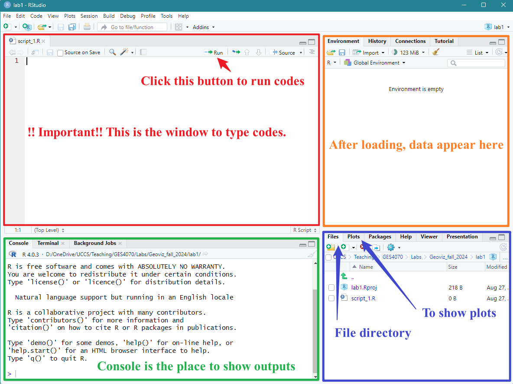

## Submission Requirement

**You are required to submit a report for this lab. Please follow the instructions below, complete "Lab1-report" and submit it on Canvas.  **


### 1. Software Installation

#### 1.1 R and RStudio

R is the based app to process R programming language, and RStudio integrates with R to provide further functionality such as graphical user interface (GUI). We need to install both **R** and **RStudio** for this workshop. \

**Note**: there are R and RStudio installed in the computer lab. Please use the PCs in the lab if you cannot install. \


#### 1.2 Install R
We will install R first.  \

Windows users: 

* Please go to the website: https://cran.rstudio.com/
* Download and install R
* Download R for Windows
* install R for the first time
* Download R-4.4.1 for Windows (Remember the folder where you save it!!)
* Go to the folder where you save the file “R-4.4.1-win.exe”, double click to run the installation, use default settings, click “Next” until the end 
* Finish


Mac users: 

* Please go to the website: https://cran.rstudio.com/
* Download R for macOS 
* Under the “Latest release”, download the version that is suitable for your machine (“R-4.4.1-arm64.pkg” or “R-4.4.1-x86_64.pkg”) --> save 
* Go to the folder where you save the file, run the installation, use default settings, click “Next” until the end
* Finish


#### 1.3 Install RStudio
Next, we will install RStudio, the GUI of R.  \

Windows users: 

* Please go to: https://posit.co/download/rstudio-desktop/ 
* Download RStudio desktop for windows, then Save
* Go to the folder where you download the file “RStudio-2024.04.2-764.exe” 
* Run the installation, use default settings, click “Next” until the end  
* Finish


Mac users:  

* Please go to: https://posit.co/download/rstudio-desktop/ 
* Scroll down 
* look for “macOS 12+”, click “RStudio-2024.04.2-764.dmg” and save
* Go to the folder where you download the file 
* Run the installation, use default settings, click “Next” until the end 
* Finish


### 2. Good Practice - Organizing Folders  

It happens to me all the time that my course A files are mixed with course B's. 
To make things easier, I highly recommend organizing your folders in the following way: 

* Create a folder specifically for this course (e.g., Geoviz_fall_2024). 
* Under the course folder, create a series of sub-folders for different labs and assignments separately, for example, folders with  "lab1", "lab2", "lab3"....."assignment1", "assignment2"....(see Figure 1.1)
* For each lab, work in that specific folder. For example, for this lab, you could work in the "lab1" folder under the "Geoviz_fall_2024" course folder.  \

{width=70%} 
<br>
<br>

### 3. Launching RStudio
Remember that we have installed both **R** and **RStudio** earlier? But for this lab and for all future ones, we only need to run **RStudio**. This is because **R** is the hidden computing infrastructure while **RStudio** is the interface.  

Run RStudio.  

{width=40%}

If it is the first time to run RStudio, it may ask you to "select the version of R to use". Use the default option "64-bit version of R”, click "OK". "Enable automated crash reporting" --> "Yes"

After launching RStudio, you will see the following interface (Figure 1.3).
{width=100%}

<br>
<br>

#### 3.1 Create a project

Before creating a project, please make sure that you have already created your course folder and the sub-folder "**lab1**" as mentioned in *Section 2: Good practice*. \

In RStudio menu --> File --> New Project --> *Existing* Directory --> Browse & Navigate to the course folder, then the sub-folder “**lab1**” --> Double clicks to go inside of the folder “**lab1**” --> Open --> Create Project \

*Note: we will need to repeat this to create projects for future labs and assignments.* \


#### 3.1 Create a new script

A **script** is a sequence of instructions that can be executed by a computer or programming language (in our case, R). \ 
To create a new script, in RStudio menu --> New File --> R Script (see Figure 1.4) \ 

{width=100%}


<br>

Then, we also need to save the script to the "lab1" folder. File --> Save --> Specify File Name --> Save (see Figure 1.5) \

{width=70%}

After creating and saving the new script, you should see something similar to Figure 1.5. \
{width=100%}

Let's try to coding now. First, let's ask the machine to do math for us. 

* Type the following command in the top-left window (red in Figure 1.5)
* Select that line
* click run

```{r}
2+5+8
```
{width=100%}
Next, let's asking the machine to print some words for us. Type the following command and run it. 
*Hint: to run codes, please select lines and click "Run" *

```{r}
print("GES Geovisualization")
```
**Good Coding Practice:**

* Always start a new line when writing a new command; 
* In R & RStudio, scripts are !!case-sensitive!! Changing the capitalization of codes can run into errors. 


### 4. Let's start mapping! 


**tmap** is a commonly used package in R for mapping. We install this package first. Type the command in your script and click "run". 

```{r, eval=FALSE}
install.packages("tmap")
```

Then, we load the **tmap** package. Again, type --> select --> run

```{r, eval=FALSE}
# load "tmap"
library(tmap)
```

#### 4.1. Hello World! 
The package **tmap** itself has a dataset on countries. Let's load the data first, and create a world map based on their level of inequality.  

Please run the command below on your local machine. What do you see under the **Plot** tab on bottom right? Click "Zoom". 
Please do a screenshot of the map and paste it to your "**Lab1 Report**". 
```{r, eval=FALSE}
# load the world data
data("World")

# create a map
tm_shape(World) +
    tm_polygons("inequality")
```

Close the "Plot Zoom" window and go back to the script. 

#### 4.2 Interactive Map
Next, we will create an interactive map to explore countries' happy planet index (HPI). The Happy Planet Index is a measure of sustainable well-being in considering human well-being and environmental impact. 

We will use a different color palette (Yellow & Green) for this map. Type the code to your script --> select --> run.  
```{r, eval=FALSE}
tmap_mode("view")

tm_shape(World) +
    tm_polygons("HPI", palette = "YlGn")
```

Under the **Plot** tab, click "Zoom". Please do a screenshot of the map and paste it to your "**Lab1 Report**".\
Hover over the map and click any country, you should be able to see their HPI index. Please report HPI indexes of any five countries to "**Lab1 Report**". 

