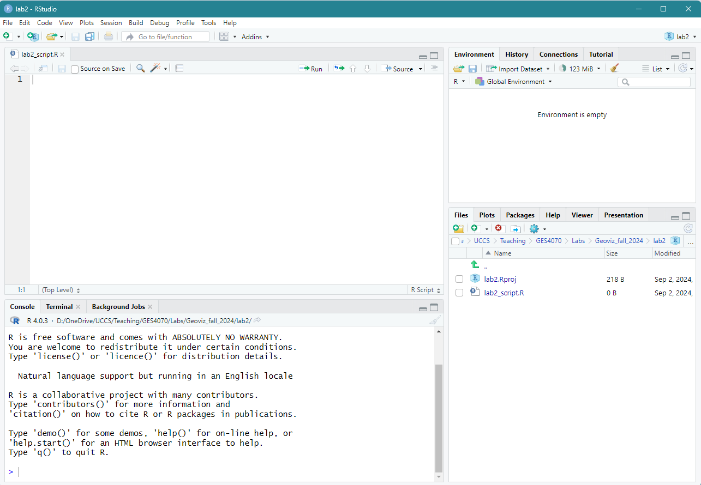

### 2.1 Lab Goals 

After completing this chapter, you should be able to:

* Assign a variable and view its  
* Understand what are different data types and how they are used in the context of geo-visualization
* Clean, calculate and manipulate different data types 

### 2.2 Good Practice

#### 2.2.1 Organizing Folders 
Let's first navigate to the course folder that we have created for the previous lab (see [Chapter 1.2](https://fuzhen-yin.github.io/uccs_geoviz/lab1.html#12_Good_Practice_-_Organizing_Folders)), and create a folder called **lab2**. 

#### 2.2.2 Housekeeping

We'll use RStudio again for this chapter. Please open RStudio as we have explained in  [Chapter 1.3](https://fuzhen-yin.github.io/uccs_geoviz/lab1.html#13_Launching_RStudio). 

(*Note: all computers in COH 329 should have an updated RStudio already*). 

Before starting any works, please make sure you are in fresh **new project** with a **blank script**. Please follow the action checklist below: 

* Step 1: Is the previous project "Lab 1" closed? 
  + If *not*, please close it by go to *File* --> *Close Project* --> *Save* changes. 
* Step 2: Create a **New Project** using **Existing Directory**, navigate to **lab2**, click **open**, then **Create Project**. 
* Step 3: Create a **New Script** by go to **File** --> **New File** --> **R Script**. **Save** the script by giving it a proper name.

At this step, you should see something similar to Figure 2.1. If you have any questions about the above steps, please refer to [Chapter 1.3: Launching RStudio](https://fuzhen-yin.github.io/uccs_geoviz/lab1.html#13_Launching_RStudio) for detailed instructions. 

{width=100%}

 

### 2.3 Intro to Programming using R

