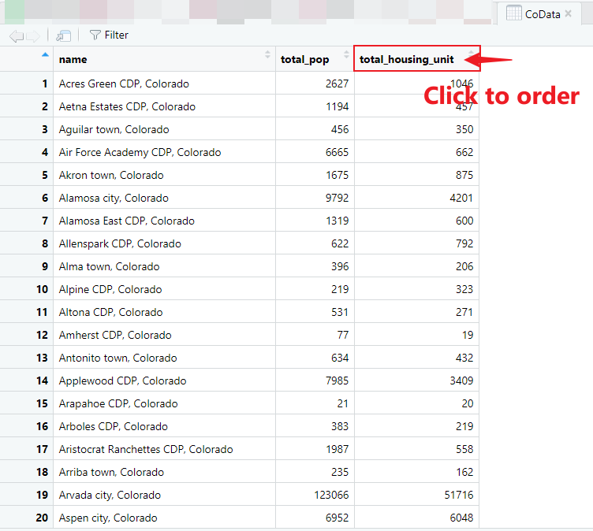

```{css style settings, echo = FALSE}
blockquote {
    padding: 10px 20px;
    margin: 0 0 20px;
    font-size: 15px;
    border-left: 5px solid #90e0ef;
}
```


### 2.1 Lab Goals 

After completing this chapter, you should be able to:

* Assign a variable and view its  
* Understand what are different data types and how they are used in the context of geo-visualization
* Clean, calculate and manipulate different data types 

### 2.2 Good Practice

#### 2.2.1 Organizing Folders 
Let's first navigate to the course folder that we have created for the previous lab (see [Chapter 1.2](https://fuzhen-yin.github.io/uccs_geoviz/lab1.html#12_Good_Practice_-_Organizing_Folders)), and create a folder called **lab2**. 


#### 2.2.2 Housekeeping

We'll use RStudio again for this chapter. Please open RStudio as we have explained in  [Chapter 1.3](https://fuzhen-yin.github.io/uccs_geoviz/lab1.html#13_Launching_RStudio). 

(*Note: all computers in COH 329 should have an updated RStudio already*). 

Before starting any works, please make sure you are in fresh **new project** with a **blank script**. Please follow the action checklist below: 

* Step 1: Is the previous project "Lab 1" closed? 
  + If *not*, please close it by go to *File* --> *Close Project* --> *Save* changes. 
* Step 2: Create a **New Project** using **Existing Directory**, navigate to **lab2**, click **open**, then **Create Project**. 
* Step 3: Create a **New Script** by go to **File** --> **New File** --> **R Script**. **Save** the script by giving it a proper name.

At this step, you should see something similar to Figure 2.1. If you have any questions about the above steps, please refer to [Chapter 1.3: Launching RStudio](https://fuzhen-yin.github.io/uccs_geoviz/lab1.html#13_Launching_RStudio) for detailed instructions. 

{width=100%}

<br>

### 2.3 Intro to Programming using R

R is a mixture of programming paragrams (Cotton, 2013). At its core, it is an **imperative language**. 

> An **imperative language** provides step-by-step instructions for a computer to perform a task. Your write a script that does one calculation after another. Therefore, the order to run codes in your script can affect outcomes.

But it is also supports **object-oriented programming** and **functional programming**. 

> **Object-oriented programming (OOP)** is based on the concept of objects, which can contain data and code. Data in the form of fields (e.g., variables) and code in the form of procedures. 

> **Functional programming** is constructed by applying and composing functions. In R functions are first-class objects. You can treat them like any other variable and call them recursively.

#### 2.3.1 Variables & Data Types

Let's create some variables. 
*Note: the codes below are pretty simple. Please try to re-write them by yourself and understand the purpose of each line.*


a) **Integers (int)** are whole numbers, e.g., 1, 10, -10. Run the code below and observe what do you see in the **Environment** panel on the top-right corner (see Figure 2.2). Do you see a new variable *"var_int"*?
```{r}
var_int <- 99
```


<br>
We can also create consecutive integers by using the symbol ``` : ``` 
```{r, eval=FALSE}
# create consecutive integers 
var_ints <- -5:5

# let's check this variable
print(var_ints)
```

**Note:**

* The symbol ``` # ``` is used to write comments. Comments are completed ignored by R and just there to make the code more readable.  \
* The shortcut to write ``` <- ``` is ``` Ctrl ``` + ``` - ``` .

b) **Other numerics** such as the floating-point number (float) often includes a decimal point, e.g., 3,14, -99,99, 5.0. 
```{r, eval=FALSE}
# Let's create floats by using the coordinates of UCCS as an example
var_long <- -104.801     
var_lat <- 38.892    
```

c) **Characters** are used to store text (also called "strings"). To indicate something is a character, we put *quotation marks* around it ``` "" ```.
```{r, eval=FALSE}
# Create a character to indicate a city name. 
var_char <- "Colorado Springs"

# Check the class of this variable "var_char"
class(var_char)
```

d) The **Logical** class only has two possible values: ``` TRUE ``` or ``` FALSE ```. They can also be written as ``` T ``` or ``` F ```, but never *true* or *false* because R programming is *case-sensitive*. Logicals are useful to evaluate logical statements. 
```{r}
# We can ask the machine to compare numbers. For example, we assign values to "a" and "b".
a <- -5
b <- 5

# Then, we ask the machine to compare the two values. 
a > b
```


e) A **vector** is an ordered set of values by using the function ``` c() ```. Vectors are extremely important in statistics and data science, since we usually want to analyze a whole dataset rather than just a piece of data. 
```{r, eval=FALSE}
# Vector can include a series of numeric values, by specifying them one by one
var_vec_num1 <- c(478961, 715522, 108250, 386261)      
var_vec_num1

# or by using the symbol : to create consecutive integers 
var_vec_num2 <- c(1:10, -99:-95)
var_vec_num2

# Vector can also include characters
var_vec_char <- c("Colorado Springs", "Denver", "Bouder", "Aurora")
var_vec_char

# or a mix of characters and numeric values 
var_vec_mix <- c(1,3,5, "Aspen", "Pueble", 99)
var_vec_mix
```

#### 2.3.2 Data frame Basics

**Data frames** are used to store spreadsheet-like data. It provides a *table-like* way to organize multiple vectors into one object.   Data frames are also the most widely used format to *clean, manipulate and analyze* data. In this lab, we only learn the very basics of creating a simple data frame. We will learn more about it in future chapters. \

Let's use the function ``` data.frame() ``` to create a data frame called "*df_city_pop*" to record the number of population in four cities in Colorado. 

```{r, eval=FALSE}
# We create a table with two columns ("city" and "population") and four rows
# Hint: to make this code work, you need to select all four lines and run them together. 
df_city_pop <- data.frame(
  city = var_vec_char, 
  population = var_vec_num1
)
```

After ruining the code above, do you see a new variable *df_city_pop* in the Environment panel? Try to click on that variable and see what happens. Do you see the table? Please do a screenshot of the table and paste it to your "**Lab2 Report**". 

#### 2.3.3 Scientific Calculators 

Next, we calculate some statistics for the four cities in the data frame *df_city_pop*. Please close the table and go back to your script. \
To exact a particular column from a data frame, we use the symbol ``` $ ```. 

```{r, eval=FALSE}
# Let's examine the values in the "population" column 
print(df_city_pop$population)

# Calculate the total number of population 
sum(df_city_pop$population)

# The mean value
mean(df_city_pop$population)

# Median 
median(df_city_pop$population)
```


### 2.4 Cities and Towns in Colorado

#### 2.4.1 Reading an External .csv File as a Data Frame. 
Let's play with some external data! I have used [US Census Bureau](https://data.census.gov/) to collect the total population and total housing unit in cities and towns in Colorado. This data was collected by **US Census Bureau** on 2022 through the **5-year American Community Survey (ACS)** survey. **US Census Bureau** contains a lot of good dataset. We will explore that later. \ 

Let's pull the data in straight from the web using the function ``` read.csv() ``` and save it into a new variable "CoData". 
```{r, eval=FALSE}
CoData <- read.csv(url("https://raw.githubusercontent.com/fuzhen-yin/uccs_geoviz/main/data/00_ACS_5yrs_estimate_2022_places_colorado_population_housing.csv"))
```

Click "CoData" in the Environment panel and examine the table a little bit. Report the following information to your "**Lab2 Report**". In the table, by clicking a particular column name, you can **order** the table based the column's value (see Figure 2.3).

* How many rows or records in this table? 
* How many columns and what are their names? 
* What are the top three cities with the highest number of populations and housing units?


{width=50%}

<br>

#### 2.4.2 Descriptive Statistics 

Let's examine the "CoData" column by column. Let's check What are the columns in the "CoData" data frame using ``` names() ```.
```{r, eval=FALSE}
names(CoData)
```
Next, we check their data types using ``` str() ```. 
```{r, eval=FALSE}
str(CoData)
```

The column "name" is **characters**, while the other two columns "total_pop" and "total_housing_unit" are **integers.** For these two numerical columns, we calculate some basic statistics for them. Remember the symbol ``` $ ```, we will use it again to pull out a particular column. 

```{r, eval=FALSE}
# First, let's calculate the statistics of "total_pop" 
summary(CoData$total_pop)
```

The ``` summary() ``` function gives us the *(1) minimum, (2) 1st quartile, (3) median, (4) mean, (5) 3rd quartile and (6) maximum*. 

Please write the code by yourself to calculate the above statistics for the column "total_housing_unit" and paste the outputs to "**Lab2 Report**". 


#### 2.4.3 Visualization 

We are going to use the library ``` ggplot2 ``` visualization. ``` ggplot2 ``` is a very popular open-source data visualization package. Let's install this package and launch it. 
```{r, eval=FALSE}
# install packages (only need to install once)
install.packages("ggplot2")

# launch it (have to launch it everytime we open RStudio). 
library(ggplot2)
```

This chapter is already pretty lengthy. Let's just do some basic visualization stuff and we will go back to this package for much cooler visualization later this semester. 

We create a scatter plot to explore how cities' total population are associated with the numbers of their total housing units.  

```{r, eval=FALSE}
ggplot(CoData, aes(x=total_pop, y =total_housing_unit )) + 
  geom_point()
```


We can improve the design of this scatter plot by using different color palette, background color, transparency etc. 

* ``` color = ```: shape outline color;
* ``` fill = ``` : shape fill color;
* ``` shape = ```: shape. Please google *ggplot2 shape code* for more information; 
* ``` alpha = ```: shape transparency;
* ``` size = ```: shape size;
* ``` stroke = ```: stroke. 


```{r, eval=FALSE}
ggplot(CoData, aes(x=total_pop, y =total_housing_unit )) + 
  geom_point(
    color="black",
    fill="#fb8500",
    shape=22,
    alpha=0.5,
    size=4,
    stroke = 1
  ) + 
  theme_bw()
```

Based on the code above, please make some changes to the plot and paste the final scatter plot to your "**Lab2 Report**". 


### References 
Cotton, R. (2013). Learning R: A step-by-step function guide to data analysis. " O'Reilly Media, Inc.".


