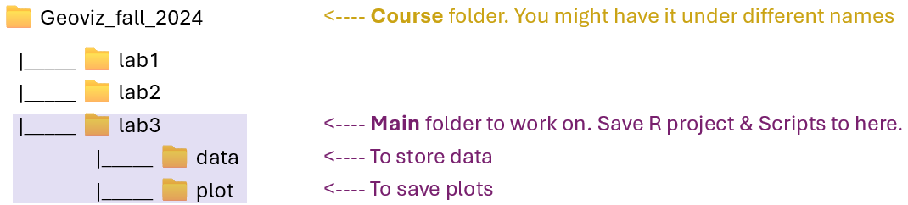
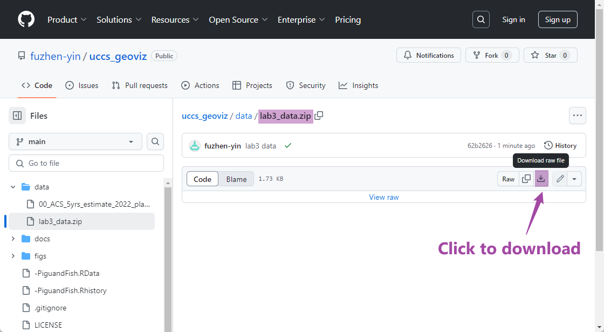
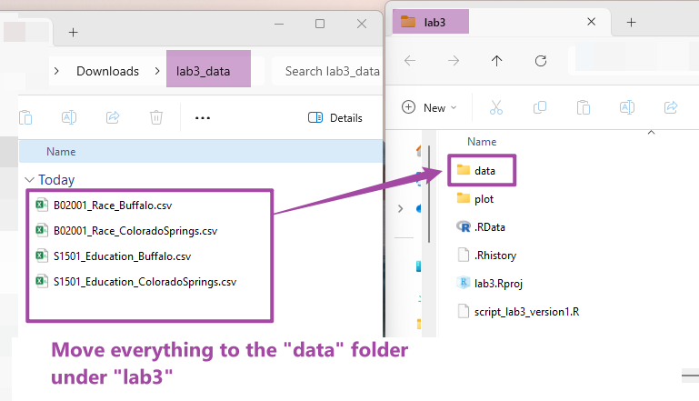

```{r setup, include=FALSE}
knitr::opts_chunk$set(echo = TRUE)
```


```{css style settings, echo = FALSE}
blockquote {
    padding: 10px 20px;
    margin: 0 0 20px;
    font-size: 15px;
    border-left: 5px solid #90e0ef;
}

.purplebox {
  padding: 1em;
  background: #f0e8fa;
  color: #5c24a1;
  border: 2px dotted #926dc0;
  border-radius: 4px;
}

.purple_border {
  padding: 1em;
  background: white;
  color: #5c24a1;
  border: 2px dotted #926dc0;
  border-radius: 4px;
}

.center {
  text-align: center;
}
.left {
  text-align: left;
}
```


### 3.1 Lab Goals 

This chapter aims to introduce the complete workflow of data analysis and visualization using R. After reading it, you should be able to:

* **import** data from local files 
* **clean** and **transforming** data, such as: 
  + extract data corpus 
  + join rows of different data frames into one
  + understand sorting and ordering 
* **draw** standard plots for _exploratory_ and _visualization_ purpose by producing:
  + bar charts 
  + line plots
  + pie charts
  + waffle charts
  
* **export** plots as local files 

### 3.2 Good Practice 

Okay, I guess you already know what I am going to repeat. However, there are something [new]{.ul} for this lab. I will try to be brief :) 


#### 3.2.1 Organizing Folders & Sub-folders

Similar to what we have done in previous labs, under the course folder, please create a folder called "**lab 3**". Next, in the **lab3** folder, please create two [sub-folders]{.ul} that one is called "**data**" and another one is "**plot**". 
We'll use the "**data**" folder to store data collected from the internet. The "**plot**" will be used to export plots generated from R. 

After created these folders, your folders should look similar to Figure 3.1. 

{width=70%}
<br>
<br>


#### 3.2.2 Data
I have collected some tables for this lab. These tables tell use about population's [education attainment]{.ul} and [racial diversity]{.ul} in two cities: Colorado Springs (CO) and Buffalo (NY). These data are collected from [US Census Bureau](https://data.census.gov/) using the [American Community Survey](https://www.census.gov/programs-surveys/acs/about.html)'s 5-year estimates. 


Please follow the steps below: 

* **Go** to https://github.com/fuzhen-yin/uccs_geoviz/blob/main/data/lab3_data.zip
* **Download** the file _"lab3_data.zip"_ (see Figure 3.2)

  {width=70%}

* **Unzip** folder _"lab3_data.zip"_ (see Figure 3.3)

  {width=35%}

* **Move** all files to the _"data"_ folder we just created in [Step 3.2.1](https://fuzhen-yin.github.io/uccs_geoviz/lab3.html#32_Good_Practice) (see Figure 3.4)

  {width=60%}


#### 3.2.3 Housekeeping & Launching RStudio
Again, we would like to start a **new project** from scratch with a **clean R Script**. Please do the following steps. If you have any questions about these steps, please refer to the previous chapters for help. 

* Step 1: Make sure all existing R projects are **properly closed**. 
    + If *not*, please close it by going to *File* --> *Close Project* --> *Save* changes (see [Chapter 2.5](https://fuzhen-yin.github.io/uccs_geoviz/lab2.html#25_Close__Exit)). 
* Step 2: Create a **New Project** using **Existing Directory**, navigate to **lab3**, click **open**, then **Create Project**. (see [Chapter 1.3](https://fuzhen-yin.github.io/uccs_geoviz/lab1.html#13_Launching_RStudio)). 
* Step 3: Create a **New Script** by go to **File** --> **New File** --> **R Script**. **Save** the script by giving it a proper name.


#### 3.2.4 Before You Start

:::: {.purplebox data-latex=""}
::: {.left data-latex=""}
[**Heads-Up! **]{.ul}
:::

This is a pretty **long tutorial** but it will guide you through a complete workflow of data analysis and visualization. As you can imagine, this will be a steep learning curve. Please take _regular breaks_ (see instructions below). 

This tutorial covers most of the techniques for **Assignment 2**. Please try to:

* Re-write the script by yourself. 
* Read through the text carefully and try to understand what bits of code are doing as you go. 
* It's okay that you don't fully understand some codes. Don't worry as the key is to revisit later and try to work out what is going on. Learning is a iterative process. 
* Start to think about how you can adapt a particular line of code or functions to your own project. 
* Be CURIOUS!! Ask QUESTIONS!!

::::


<br>

:::: {.purple_border data-latex=""}
::: {.left data-latex=""}
[**Only Read This If You Plan to Take Breaks!**]{.ul}
:::

If you plan to work on this lab later, please remember to **save your script**, and **properly close** the [project]{.ul} and [RStudio]{.ul}. To **reopen** your project, please:

* Step 1: launch RStudio.
* Step 2: open project by going to _"File"_ --> _"Open [Project]{.ul}"_ --> Navigate to your _"lab3"_ folder, click to open [**lab3.Rproj**]{.ul}.
* Step 3: You should be able to see your script for lab3. 
  + If not, go to _"File"_ --> _"Open [File]{.ul}"_ --> Navigate to your _"lab3"_ folder, and open the script with the suffix **[.R]{.ul}**. 
* Step 4: Before writing new lines, please run the existing script from top to bottom.  

::::

### 3.3 Viz: Population Growth 
Finally, we'll start coding! From now, each section is an **independent** project that each produces one or more graphics for different purposes. Each project will expose you to a complete data analysis and visualization **workflow.** 


We will use two cities _Colorado Springs (CO)_ (a growing city) and _Buffalo (NY)_ (a declining city) for case studies. The purpose of these graphics is to understand their different _socio-demographic characteristics_. 
This section is to produce a plot [comparing the population growth between two cities]{.ul}. 

Let's **install** & **call** some libraries first. Last time, we have used ``` ggplot2 ```. This time, we will learn another library ``` dplyr ``` and ``` waffle ```. 

> ``` dplyr ``` is a very commonly used package for **data frame manipulation** ([read more](https://dplyr.tidyverse.org/)). 
> ``` waffle ``` is a package to produce waffle chart. 

```{r, eval=FALSE}
## Install libraries
install.packages("dplyr")
install.packages("waffle")

## If you don't have the package "ggplot2" installed
## please (1) un-comment the code below by deleting the hash tag; (2) run it
# install.packages("ggplot2")
```

After installing packages, we call the three libraries. _Hint: Everytime you open or restart an R project/script, you would need to call libraries. But you don't need to install them every time_

```{r, eval=FALSE}
## Library 
library(ggplot2)  # plot
library(dplyr)    # data manipulation
library(waffle)   # waffle chart
```

#### 3.3.1 Create Population Data 2010-2022

Data is the fundamentals of visualization. Here, we create a data frame (or table) to store the population data of Colorado Springs (COS) for 12 years, from 2010 to 2022. The **original data** is from [US Census Bureau](https://data.census.gov/) and  [Table S0101: Age and Sex](https://data.census.gov/table/ACSST5Y2022.S0101?g=160XX00US0816000,3611000). Here, we replicate some of the data records from that table. 

> We use the function ``` data.frame() ``` to create a new table and give the table a name _"pop_cos"_. We want the table have three columns which are _year_, _population_ and _city_.  

```{r, eval=FALSE}
## Colorado Springs, CO (COS)'s Population Change 2010-2022 
pop_cos <- data.frame(
  year = c(2010:2022),
  population = c(403983,410688,417534,425805,433547,442040,448759,450000,457502,464871,471686,475282,479612),
  city = "Colorado Springs"
)
```


Next, let's briefly check the data types in this table using the ``` str() ``` function. And have a look at the table using ``` View() ```. The ``` View() ``` function is the same as you click the _"pop_cos"_ variable in the **Environment** Tab. 

```{r, eval=FALSE}
# Check data type 
str(pop_cos)

# View the data frame "pop_cos". 
View(pop_cos)
```

Okay, let's go back to the script and create another data frame for Buffalo (NY) and assign the data frame to the variable _"pop_buf"_. 

```{r, eval=FALSE}
## Buffalo, NY (BUF)'s Population Change 2010-2022 
pop_buf <- data.frame(
  year = c(2010:2022),
  population = c(266012,263914,261955,260568,259959,259517,258989,259574,257518,256480,255805,276011,276688),
  city = "Buffalo"
)
```


#### 3.3.2 Data Query & Analysis

Let's explore these two data frames _"pop_cos"_ and _"pop_buf"_ a little bit. Remember the ``` $ ``` symbol? It can be used to select a particular column from a data frame. Let's check the summary statistics of population in the two cities by using ``` summary() ```. 
```{r, eval=FALSE}
# What are the column names? 
names(pop_cos)
names(pop_buf)

# Summary statistics of the population column - COS? 
summary(pop_cos$population)

# Summary statistics of the population column - BUF? 
summary(pop_buf$population)
```

The summary statistic suggests that Colorado Springs has more population than BUF. Next, let's look at the data frame more carefully by sub-setting particular records based some conditions. 

* Extract a particular column within the data frame by calling the column name. 
```{r, eval=FALSE}
# subset the "population" column from the "pop_cos" data frame
pop_cos['population']
```

* Exacting two or more column by calling column names. The ``` c() ``` function combines two elements ``` "year" ``` and ``` "population" ``` into a vector. 
```{r, eval=FALSE}
# subset two columns "year" and "population" from the "pop_cos" data frame
pop_cos[c('year','population')]
```

* Select records based on conditions (e.g., when population is over 450000). The code below gives you all rows that with a population over 450000. 
```{r, eval=FALSE}
# Check at what years COS has more than 450000 population 
pop_cos[pop_cos$population > 450000,]
```

Okay, the output suggests that since 2018, Colorado Springs has population exceeding 450000. Now, let's check that for Buffalo. 
```{r, eval=FALSE}
# Check at what years BUF has more than 450000 population 
pop_buf[pop_buf$population > 450000,]
```

Oops! It seems Buffalo never had its population over 450000. All these comparison suggests at least in the last decade, Colorado Springs is more populated than Buffalo. 

Next, let's calculate the **population growth rate** from 2010 to 2022 for the two cities. The population growth rate is calculated using the equation below (Eq. 3.1):

$$ Growth Rate = 100 * \frac {Population_{2022} - Population_{2010}} {Population_{2010}} $$

<br> 

Calculate the population growth rate for Colorado Springs. We extract the # of population in 2010 and 2022 separately. 

The code below is (1) asking the machine to locate the record (or row) in the data frame _"pop_cos"_ with the ``` year ``` column equal to 2022, (2) asking the machine to return the value in the ``` population ``` column, (3) and save that value as a new variable ``` pop_cos_2022 ```. 
```{r, eval=FALSE}
# Filter a particular value  population in a particular year 
# Colorado Springs' population in 2022
pop_cos_2022 <- pop_cos[pop_cos$year == "2022", "population"]
# Colorado Springs' population in 2010
pop_cos_2010 <- pop_cos[pop_cos$year == "2010", "population"]
```

After extracting the population values for 2010 and 2022, let's calculate the growth rate using Eq. 3.1. Please report the value of ``` pop_change_cos ```  to the **lab3 report**. 
```{r, eval=FALSE}
# population growth rate - COS
pop_change_cos <- 100 * (pop_cos_2022 - pop_cos_2010) / pop_cos_2010
pop_change_cos
```

Next, we calculate the population growth rate for Buffalo. Please report the value of ``` pop_change_buf ```  to the **lab3 report**. 
```{r, eval=FALSE}
# Buffalo' population in 2022
pop_buf_2022 <- pop_buf[pop_buf$year == "2022", "population"]
# COS' population in 2010
pop_buf_2010 <- pop_buf[pop_buf$year == "2010", "population"]

# calculate population growth rate 
pop_change_buf <- 100 * (pop_buf_2022 - pop_buf_2010) / pop_buf_2010
pop_change_buf
```

Okay, it seems both cities have positive population growth rates between 2010 and 2022. But Colorado Springs has such a rapid growth in the past decade. Compared to Colorado Springs, Buffalo was experiencing an incremental population growth. 

**BUT**! Does this give us a **full picture** of population changes of two cities? I am not sure. Let's visualize their population year by year and see what we can find. 

#### 3.3.3 Line Plots

Let's combine the two data frame ``` pop_cos ``` and ``` pop_buf ``` together and save it as a new variable ``` pop_cos_buf ```. Remember that we have checked their column names in [Step 3.3.2.](https://fuzhen-yin.github.io/uccs_geoviz/lab3.html#332_Data_Query__Analysis) One condition to combine rows together is that they need to have the same column names.  

```{r, eval=FALSE}
## Combine two data frames together by rows. This requires two data frames have the same column names 
pop_cos_buf <- rbind(pop_cos, pop_buf)

## Have a look at the table 
View(pop_cos_buf)
```

Then, we produce a simple line chart of population growth for two cities by using the ``` ggplot() ``` function. The code below asks the machine to do the following tasks. 

* ``` data = ``` specifies to use ``` pop_cos_buf ``` as the base data; 
* ``` aes() ``` describe how variables in the data are mapped to visual properties; 
* ``` geom_line() ``` makes a line plot. 


```{r, eval=FALSE}
# a line chart of population growths: basic version 
ggplot(data = pop_cos_buf, 
       aes(x=year, y=population, group=city, color=city)) + 
  geom_line()
```

Well, it produces a plot showing the population trend in two cities. It's good and fast to explore the data. But, I am not satisfied with how it looks. For example: 

* I don't like the grey background. 
* The x-axis labels are with decimals which are not good for years. 
* The lines seem not thick enough.  

Let's improve the plot by giving more instructions in terms of how we want the plot illustrates the data. Please run the code blow and observe how this plot is different from the previous one. In **lab3 report**, please report what are the purpose of these codes: 

* ``` scale_x_continuous(breaks =c(2010,2012,2014,2016,2018,2020,2022)) ```
* ``` ggtitle("Population Changes in Two Cities") ```
* ``` xlab("Year") ```
* ``` ylab("Population") ```

```{r, eval=FALSE}
# update plot 
ggplot(data = pop_cos_buf, aes(x=year, y=population, group=city, color=city)) + 
  geom_line() + 
  scale_x_continuous(breaks =c(2010,2012,2014,2016,2018,2020,2022)) + 
  ggtitle("Population Changes in Two Cities") + 
  xlab("Year") + 
  ylab("Population")
```


Let's continue to improve the plot by:

* adding data points to the plot using ``` geom_point() ``` 
* changing line colors using ``` scale_color_manual( values = c()) ``` 
* apply the minimalist theme ``` theme_minimal() ```. The package ``` ggplot ``` has many pre-defined themes (see [here](https://ggplot2.tidyverse.org/reference/ggtheme.html)).  

This time, instead of visualizing the plot directly, we save it into the variable ``` plot1_growth ``` and plot it later by calling this variable. 

```{r, eval=FALSE}
# improve the plot
plot1_growth <- ggplot(data = pop_cos_buf, aes(x=year, y=population, group=city, color=city)) + 
  geom_line(linewidth  = 0.5) + 
  geom_point(size = 0.7) + 
  scale_x_continuous(breaks =c(2010,2012,2014,2016,2018,2020,2022)) + 
  scale_color_manual(values = c("purple","orange")) + 
  ggtitle("Population Changes in Two Cities") + 
  xlab("Year") + 
  ylab("Population") +
  theme_minimal()

# view the plot 
plot1_growth
```

#### 3.3.4 Export Plots 

It seems the plot ``` plot1_growth ```  is good enough. Let's stop here for now and export it to the _"plot"_ folder we have created in [Step 3.2.1.](https://fuzhen-yin.github.io/uccs_geoviz/lab3.html#321_Organizing_Folders__Sub-folders). We will export it as a [.pdf]{.ul} file because it can store information in vector format and is easier to edit later. We will use the function ``` pdf() ```. 

> The path ``` "plot/plot1_population_growth_two_cities.pdf" ``` tells the machine to save the pdf to the _"plot"_ folder and name it as _"plot1_population_growth_two_cities.pdf"_. Feel free to use a different name. 

```{r, eval=FALSE}
pdf("plot/plot1_population_growth_two_cities.pdf", width = 6, height =3 )
print(plot1_growth)
dev.off()
```

After running the code above, please go to  **lab3** folder --> **plot** folder. Do you see a pdf there? Open it and do a screenshot for **lab3 report**. 


<br>


### 3.4 Viz: Education Attainment 
I know it's a lot already. If you plan to **take a break**, this is a good time! Please refer to [Section 3.2.4](https://fuzhen-yin.github.io/uccs_geoviz/lab3.html#324_Before_You_Start) for instructions on how to properly close the project and re-open it later. 

#### 3.4.1 Get Data
Okay, if you plan to continue, hang on tight! I will be very brief to save times & efforts. 

This section explores the education attainment (of people 25 years and older) of the two cities, Colorado Springs and Buffalo. Unlike the previous section, this time we read the data from local **.csv** files using the function ``` read.csv() ```. The file path ``` data/S1501_Education_ColoradoSprings.csv ``` tells the machine to go to the ``` data ``` folder and import the **.csv** file _"S1501_Education_ColoradoSprings.csv "_. 

```{r, eval=FALSE}
## Education Attainment - Colorado Springs
edu_cos <- read.csv("data/S1501_Education_ColoradoSprings.csv")

## Education Attainment - Buffalo
edu_buf <- read.csv("data/S1501_Education_Buffalo.csv")
```

Check data type. 
```{r, eval=FALSE}
str(edu_cos)
str(edu_buf)
```

> The Education Attainment data is collected from  [US Census Bureau](https://data.census.gov/) via ACS 5-year survey. The link of the original table is [S1501: Educational Attainment](https://data.census.gov/table/ACSST1Y2022.S1501?q=education&g=160XX00US0816000,3611000). The data we have in the .csv files are a corpus of that table by focusing on population age 25 and elder.  

Let's have a look at the table first. 

```{r, eval=FALSE}
View(edu_cos)
View(edu_buf)
```


#### 3.4.2 Data Manipulation

The ``` Count ``` column tells us how many people is at a particular education level. Let's check the total number of people in this data by using the ``` sum() ``` function. 

```{r, eval=FALSE}
# Check the total population age 25 and over in each city 
sum(edu_cos$Count)
sum(edu_buf$Count)
```

Intead of the column _"count"_, we are more interested in calculating the _"percentage"_ of population in each level. The percentage is calculated as: 

$$ \% \ of \ people \ in \ a \ particular \ level =  100 * \frac {Count \ of \ people \ in \ a \ particular \ level} {Total \ population} $$ 
<br> 

Let's calculate the percentage in each education level and save it as a new column _"Percentage"_. 

```{r, eval=FALSE}
# Create a new column to calculate the percentage (%) of population attaining different education levels
edu_cos["Percentage"] <- 100 * edu_cos$Count / sum(edu_cos$Count)
edu_buf["Percentage"] <- 100 * edu_buf$Count / sum(edu_buf$Count)
```

#### 3.4.3 Bar Plot

Let's start to plot the education attainment for Colorado Springs. 
```{r, eval=FALSE}
# basic version. Plot two cities separately. 
ggplot(edu_cos, aes(x=Education_Level, y=Percentage)) + 
  geom_bar(stat = "identity")
```

Hmmm, the plot really doesn't look great. The x-axis texts stick together and hard to read. It will be better if we can rotate the x-axis a little bit. Let's rotate it by 45 degree. 

```{r, eval=FALSE}
# rotate x axis 
ggplot(edu_cos, aes(x=Education_Level, y=Percentage)) + 
  geom_bar(stat = "identity") + 
  theme(axis.text.x = element_text(angle = 45, vjust = 1, hjust=1))
```

It is much better. But it seems the x-axis does follow the order as the data frame. Let's check how the education level is ordered in the table ``` edu_cos ```. 

```{r, eval=FALSE}
edu_cos$Education_Level 
```

The order of education level makes more sense because it is  from the lowest to the highest. Let's force the machine to order the x-aixs as the data frame, and reproduce the plot. 

```{r, eval=FALSE}
# reorder x-axis as the data frame shows 
edu_cos$Education_Level <- factor(edu_cos$Education_Level, levels=unique(edu_cos$Education_Level))

# plot 
ggplot(edu_cos, aes(x=Education_Level, y=Percentage)) + 
  geom_bar(stat = "identity") + 
  theme(axis.text.x = element_text(angle = 45, vjust = 1, hjust=1))
```

Let's combine Buffalo and Colorado Springs together and make a bar plot for comparison. 
```{r, eval=FALSE}
# combine the rows from the two data frames "edu_cos", "edu_buf" 
edu_cos_buf <- rbind(edu_cos, edu_buf)
edu_cos_buf$Education_Level <- factor(edu_cos_buf$Education_Level, levels=unique(edu_cos_buf$Education_Level))

# make a bar plot for comparison 
ggplot(edu_cos_buf, aes(x=Education_Level, y=Percentage, fill = NAME)) + 
  geom_bar(stat = "identity", position = "dodge") + 
  theme(axis.text.x = element_text(angle = 45, vjust = 1, hjust=1))
```

Improve the plot a little bit by:

* using different colors: ``` scale_fill_manual() ```
* rename x and y labels: ``` xlab() ``` and ``` ylab() ```
* apply a black & white theme: ``` theme_bw() ```

We will save the plot under the variable ``` plot1_education ``` and call it to see the figure. 
```{r, eval=FALSE}
# change colors and use a customized theme 
plot1_education <- ggplot(edu_cos_buf, aes(x=Education_Level, y=Percentage, fill = NAME)) + 
  geom_bar(stat = "identity", position = "dodge") + 
  scale_fill_manual(values=c("#F5B19C","#0F4C81")) + 
  theme_bw() + 
  theme(axis.text.x = element_text(angle = 45, vjust = 1, hjust=1)) + 
  xlab("Education Attainment") + 
  ylab("Percentage (%)")

plot1_education
```

Have a look at the plot and observes how the two cities are different from each other in terms of education attainment.

#### 3.4.4 Export 

```{r, eval=FALSE}
# export 
pdf("plot/plot2_education_attainment_percentage_two_cities.pdf", width = 8, height =5 )
print(plot1_education)
dev.off()
```

After running the code above, please go to  **lab3** folder --> **plot** folder. Do you see a new pdf there? Open it and do a screenshot for **lab3 report**. 

### 3.5 Viz: Racial Diversity

This section examines the racial diversity in Colorado Springs and Buffalo, and uses different visualization techniques (e.g., pie chart and waffle chart) to illustrate the same data.


#### 3.5.1 Import Data 

First, let's import the data from local **.csv** files: _"B02001_Race_ColoradoSprings.csv"_ and _"B02001_Race_Buffalo.csv"_. 

> This data is collected by [US Census Bureau](https://data.census.gov/) via ACS 5-year survey. The original table is [B02001:Race](https://data.census.gov/table/ACSDT5Y2022.B02001?q=Race%20and%20Ethnicity&g=160XX00US0816000,3611000). 

```{r, eval=FALSE}
# Read Data 
race_cos <- read.csv("data/B02001_Race_ColoradoSprings.csv")
race_buf <- read.csv("data/B02001_Race_Buffalo.csv")
```

```{r, eval=FALSE}
# Examine data type 
str(race_cos)
str(race_buf)
```

```{r, eval=FALSE}
# Have a look at the data frame  
View(race_cos)
View(race_buf)
```

#### 3.5.2 Data Manipulation
Similar to [step 3.4.2](https://fuzhen-yin.github.io/uccs_geoviz/lab3.html#342_Data_Manipulation), we create a new column called _"Percentage"_ to calculate the proportion of population under each category. But this time, we want to round the column  _"Percentage"_ to two decimal digits (0.00) by using the function ``` round() ```. 
```{r, eval=FALSE}
# Calculate Percentage - COS
race_cos['Percentage'] <- 100 * race_cos$Count / sum(race_cos$Count)
# Round it to two decimal digits
race_cos['Percentage'] <- round(race_cos['Percentage'], 2)

# Let's do the same to the Buffalo race dataset 
race_buf['Percentage'] <- 100 * race_buf$Count / sum(race_buf$Count)
race_buf['Percentage'] <- round(race_buf['Percentage'], 2)
```


#### 3.5.3 Pie Charts

Create a basic pie chart representing racial composition for Colorado Springs and save it to the _"plot"_ folder. 

> In the ``` scale_fill_brewer(palette="Set3") ```, we ask the machine to apply a color palette called ``` Set3 ```. 

You can try other color palette by checking the [R Color Cheatsheet](https://www.nceas.ucsb.edu/sites/default/files/2020-04/colorPaletteCheatsheet.pdf). 
```{r, eval=FALSE}
# Basic pie chart - Colorado Springs
plot3_race_cos <- ggplot(race_cos, aes(x="", y=Percentage, fill=Race)) +
  geom_bar(stat="identity", width=1) +
  coord_polar("y", start=0) + 
  theme_void() + 
  scale_fill_brewer(palette="Set3") +
  ggtitle("Colorado Springs")

# export 
pdf("plot/plot3_race_cos.pdf")
print(plot3_race_cos)
dev.off()
```

Create a basic pie chart for Buffalo. 
```{r, eval=FALSE}
# Basic pie chart - Buffalo 
plot3_race_buf <- ggplot(race_buf, aes(x="", y=Percentage, fill=Race)) +
  geom_bar(stat="identity", width=1) +
  coord_polar("y", start=0) + 
  theme_void() + 
  scale_fill_brewer(palette="Set3") + 
  ggtitle("Buffalo")
  
pdf("plot/plot3_race_buff.pdf")
print(plot3_race_buf)
dev.off()
```


#### 3.5.4 Waffle Charts

It almost the end. Let's have some fun to conclude this practical by creating a waffle chart for the two cities. First, we combine the two data frame ``` race_cos ``` and ``` race_buf ``` and save it as a new variable ``` race_cos_buf ```. 
```{r, eval=FALSE}
## Combine rows
race_cos_buf <- rbind(race_cos, race_buf)
```

Ready for something exciting? Run the code below. 
```{r, eval=FALSE}
# waffle chart 
ggplot(data = race_cos_buf, aes(fill=Race, values=Percentage)) +
  geom_waffle(color = "white", size = 1.125, n_rows = 6) +
  facet_wrap(~City, ncol=1) +
  theme_void()
```

Let's try a different color palette ``` Set2 ``` and save the plot as a new variable. 
```{r, eval=FALSE}
# Try a different color palette
plot4_race_waffle <- ggplot(data = race_cos_buf, aes(fill=Race, values=Percentage)) +
  geom_waffle(color = "white", size = 1.125, n_rows = 6) +
  facet_wrap(~City, ncol=1) + 
  scale_fill_brewer(palette="Set2") +
  theme_void()

# call the plot 
plot4_race_waffle
```

#### 3.5.5 Export 
```{r, eval=FALSE}
# Export as a pdf
pdf("plot/plot4_race_waffle_cos_buf.pdf")
print(plot4_race_waffle)
dev.off()
```

After running the code above, please go to  **lab3** folder --> **plot** folder. Do you see a new pdf there? Open it and do a screenshot for **lab3 report**. 


### 3.6. Close & Exit

Congratulations!! You made it to the end. Let's close the project. 

Please go "File"--> "Close Project" -- a pop window asking "Do you want to save these changes" --> "Yes".

