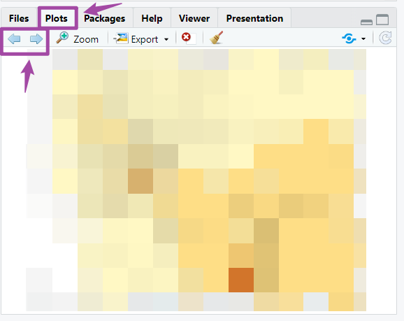

```{r setup, include=FALSE}
knitr::opts_chunk$set(echo = TRUE)
```


### 4.1 Lab Goals 

This chapter aims to introduce basic map making concepts and techniques. It applies the analysis workflow that we have learnt in [Chapter 3](https://fuzhen-yin.github.io/uccs_geoviz/lab3.html) to spatial visualization. After completing this tutorial, you should be able to:

* **Understand** the basic mapping concepts in R;
* **Interpret** and **Manipulate** tabular and spatial data collected from U.S. Census;
  + data [cleaning]{.ul} 
  + data [calculation]{.ul}
  + [filtering]{.ul} records
  + [joining]{.ul} data by columns 
* **Create** and **Export** near publishable static maps;
  + producing [choropleth]{.ul} map
  + adding [legend]{.ul}, [scale bar]{.ul} and [north arrow]{.ul}
  + [combining]{.ul} multiple maps together


### 4.2 Good Practice

#### 4.2.1 Organizing Folders & Sub-folders
Similar to what we have done in previous labs, under the course folder, please create a folder called "**lab4**". Next, in the **lab4** folder, please create two [sub-folders]{.ul} that one is called "**data**" and another one is "**plot**". 
We'll use the "data" folder to store data collected from the internet. The "plot" will be used to export plots generated from R. 


#### 4.2.2 Data
In this lab, we continue to explore **US Census Bureau** as a potential data source for administrative boundaries, and demographic, economic and population data. Specifically, we can collect:

> [Cartographic Boundaries](https://www.census.gov/geographies/mapping-files/time-series/geo/cartographic-boundary.html) by geography (e.g., cities, counties, census tracts, block groups) or by scale. And 

> [Census Tables](https://data.census.gov/) summarizing the socio-economic and demographic characteristics of particular areas.  

This practical will use **El Paso** county (where UCCS is located) as a case study to explore its **poverty level** through map making. Please follow the steps below to [download]{.ul} data, [unzip]{.ul} it and [move]{.ul} the data to the required folder. 

* **Go** to https://github.com/fuzhen-yin/uccs_geoviz/blob/main/data/lab4_data.zip
* **Download** the file _"lab4_data.zip"_
* **Unzip** folder _"lab4_data.zip"_
* **Move** all files from the "_lab4_data_" folder to the _"data"_ folder under "_lab4_" see [Step 4.2.1](https://fuzhen-yin.github.io/uccs_geoviz/lab4.html#421_Organizing_Folders__Sub-folders) 


If there you have any questions about the above-mentioned steps, please refer to [Chapter 3.2.3](https://fuzhen-yin.github.io/uccs_geoviz/lab3.html#322_Data) for detailed instructions. 


#### 4.2.3 Launching R Studio

Again, we would like to start a **new project** from scratch with a **clean R Script**. Please do the following steps. If you have any questions about these steps, please refer to the previous chapters for help. 

* Step 1: Make sure all existing R projects are **properly closed**. 
    + If *not*, please close it by going to *File* --> *Close Project* --> *Save* changes (see [Chapter 2.5](https://fuzhen-yin.github.io/uccs_geoviz/lab2.html#25_Close__Exit)). 
* Step 2: Create a **New Project** using **Existing Directory**, navigate to **lab4**, click **open**, then **Create Project**. (see [Chapter 1.3](https://fuzhen-yin.github.io/uccs_geoviz/lab1.html#13_Launching_RStudio)). 
* Step 3: Create a **New Script** by go to **File** --> **New File** --> **R Script**. **Save** the script by giving it a proper name.


#### 4.2.4 Before Start 

:::: {.bluebox data-latex=""}
::: {.left data-latex=""}
[**Heads-Up! **]{.ul}
:::

From this lab, all scripts will be **non-copyable**. Please try to:

* Re-write the script by yourself. 
  + R is case-sensitive
  + organize & structure & annotate your script. 
* Read through the text carefully and try to understand what bits of code are doing as you go. 
* It's okay that you don't fully understand some codes. Don't worry as the key is to revisit later and try to work out what is going on. Learning is a iterative process. 
* Start to think about how you can adapt a particular line of code or functions to your own project. 

::::


### 4.3 Viz: Colorado Counties Map 

#### 4.3.1 Libraries & Data  

This section starts with creating a simple map of counties in the state of Colorado. 

We are going to use the following packages:
* [dplyr](https://dplyr.tidyverse.org/): data manipulation
* [tmap](https://r-tmap.github.io/tmap/index.html): mapping
* [sf](https://r-spatial.github.io/sf/): represent simple features as records in a data.frame or tibble with a geometry list-column. 
* [data.table](https://cran.r-project.org/web/packages/data.table/vignettes/datatable-intro.html): data manipulation such as renaming.

You should have the libraries ``` tmap ``` and ``` dplyr ``` installed from previous labs. But in case you don't, please uncomment the bottom two lines and run.  

```{r, eval=FALSE, class.source = "nocopy"}
#### install library
install.packages("sf")
install.packages("data.table")

#### If you don't have "tmap" and "dplyr" installed, please uncomment these two lines and run. 
# install.packages("tmap")
# install.packages("dplyr")
```

Next, let's load some packages.
```{r, eval=FALSE, class.source = "nocopy"}
# load library
library(dplyr)
library(tmap)
library(sf)
library(data.table)
```

Check the current working directory. You should see a path ending with something similar to ``` COURSEFOLDER/lab4 ```. If not, please close the RStudio, go back to [Section 4.2.1](https://fuzhen-yin.github.io/uccs_geoviz/lab4.html#421_Organizing_Folders__Sub-folders) to organize your folder, and [Section 4.2.3](https://fuzhen-yin.github.io/uccs_geoviz/lab4.html#423_Launching_R_Studio) to re-launch RStudio.  

```{r, eval=FALSE, class.source = "nocopy"}
# working directory
getwd()
```

We will read the data from the "_data_" folder. Please make sure you can see **four** folders in your **data** folder as shown in Figure 4.1. If not, please go back to [Section 4.2.2](https://fuzhen-yin.github.io/uccs_geoviz/lab4.html#422_Data). 

{width=70%}

<br> 

We will import four data files and save them under different variable names. In previous labs, we have used the function ``` read.csv() ``` to import ``` .csv ``` files. This time, we will use ``` st_read() ``` to read shapefile (.shp).  

**Hint**: The easy way to write the ``` "FILE_PATH" ``` is to go to your "_data_" folder and copy folder & file names, and organize them using forward slashes ``` / ```. 

```{r, eval=FALSE, class.source = "nocopy"}
## US counties (simple features)
sf_us_county <- st_read("data/cb_2023_us_county_500k/cb_2023_us_county_500k.shp")

## Colorado census tracts (simple features)
sf_co_tract <- st_read("data/cb_2023_08_CO_tract_500k/cb_2023_08_tract_500k.shp")

## El Paso family in poverty - data (data frame)
df_ep_poverty <- read.csv("data/ACSST5Y2022.S1702_poverty_family_El Paso/ACSST5Y2022.S1702-Data.csv")

## El Paso family in poverty - metadata (data frame)
df_ep_poverty_meta <- read.csv("data/ACSST5Y2022.S1702_poverty_family_El Paso/ACSST5Y2022.S1702-Column-Metadata.csv")
```

Please open these data in RStudio (by clicking objects in the _Environment_ panel) and take some time to understand what are the columns.   

#### 4.3.2 Data  Pre-processing

We will start with the ``` sf_us_county ```. This data includes the information for all counties in the U.S. It also has a column _geometry_ storing the spatial boundaries of counties as polygons. 

Let's check the class of the ``` sf_us_county ``` data by using the function ``` class() ``` and have a look at it using ``` View() ```.  
```{r, eval=FALSE, class.source = "nocopy"}
# check class
class(sf_us_county)

# open
View(sf_us_county)
```

After examining the data, it seems  ``` sf_us_county ``` includes all counties in the U.S. But we are only interested in those in the state of Colorado. Let's use the function ``` filter() ``` to **extract** only Colorado counties from ``` sf_us_county ``` based on their values in the ``` STATE_NAME ``` column, and save it as a new object ``` sf_co_county ```. 

```{r, eval=FALSE, class.source = "nocopy"}
# extract CO counties
sf_co_county <- sf_us_county %>% filter(STATE_NAME == "Colorado")
```

> The ``` %>% ``` symbol is used to build **pipes** that chains multiple operations together. It takes the output of the expression on its left and passes it as the first argument to the function on its right. The shortcut of ``` %>% ``` is [``` ctrl ``` + ``` shift ``` + ``` M ```] (Windows) or [``` Cmd ``` + ``` Shift ``` + ``` M ```] (Mac). 

Have a look at the data ``` sf_co_county ```. Please write to your ***lab4 report***:

**[Q1]** How many counties in Colorado based on the data ``` sf_co_county ``` 


**[Q2]** In ``` sf_co_county ```, please locate the record of El Paso county, what is its ``` GEOID ```?  

```{r, eval=FALSE, class.source = "nocopy"}
View(sf_co_county)
```

Next,we will extract the record of [El Paso county]{.ul} from ``` sf_co_county ``` based on its value in the column ``` NAME ```. 

```{r, eval=FALSE, class.source = "nocopy"}
# El Paso County
sf_ep_county <- sf_co_county %>% filter(NAME == "El Paso")
```


In addition to use the ``` NAME ``` column to extract [El Paso county]{.ul} from  ``` sf_co_county ```. We can also use other columns such as ``` GEOID ``` and ``` NAMELSAD ```. **[Q3]** Please fill and run the commands below, and type your answers to ***lab4 report***. 

**Hint**: Have a look at the code above and also have a look at the data ``` sf_co_county ```. 

```{r, eval=FALSE, class.source = "nocopy"}
sf_ep_county <- sf_co_county %>% filter(GEOID == "TYPE_ANSWER")
sf_ep_county <- sf_co_county %>% filter(NAMELSAD == "TYPE_ANSWER")
```

#### 4.3.3 Map making 

Okay, after data extraction, we have two new datasets representing counties in Colorado and also the county of El Paso. Let's do some mapping using the ``` tmap ``` package. 

First, we set the ``` tmap_mode() ``` to ``` plot ``` for static maps. 
```{r, eval=FALSE, class.source = "nocopy"}
# static map
tmap_mode("plot")
```

Then, produce a simple map of Colorado Counties (**MAP1**).

* ``` tm_shape() ``` specifies what a spatial data object (in our case, the simple feature class).
* ``` tm_polygons() ``` draws polygons. 

```{r, eval=FALSE, class.source = "nocopy"}
# MAP1 
tm_shape(sf_co_county) + tm_polygons()
```

Produce another map of El Paso county only (**MAP2**). This time, we specify the fill color and also the border color. Feel free to try other colors.  

```{r, eval=FALSE, class.source = "nocopy"}
# MAP2
tm_shape(sf_ep_county) + tm_polygons(col = "orange", border.col = "blue")

```

Overlap MAP1 and MAP2 to produce another map that highlights the El Paso county (**MAP3**). 
```{r, eval=FALSE, class.source = "nocopy"}
# MAP3
tm_shape(sf_co_county) + tm_polygons() +
  tm_shape(sf_ep_county) + tm_polygons(col = "orange", border.col = "blue")

```

Improve **MAP3** by using the following functions and save the plot as a new variable ``` map_ep_county ```.

* ``` tm_text() ``` adds labels showing county names based on the ``` sf_co_county ``` data. 
* ``` tm_compass() ```: adds a north arrow. 
* ``` tm_scale_bar() ```: adds a scale bar and put it in the bottom-right. 

```{r, eval=FALSE, class.source = "nocopy"}
# improve MAP3
map_ep_county <- tm_shape(sf_co_county) + tm_polygons(alpha = 0) +
  tm_shape(sf_ep_county) + tm_polygons(col = "orange", border.col = "black", lwd = 2) + 
  tm_shape(sf_co_county) + tm_text(text = "NAME", size = 0.3) + 
  tm_compass(north = 0, size = 1) + tm_scale_bar(position = c("right", "bottom"), width = 0.15) 
```

Export the improved **MAP3** to the "_plot_" folder we have created in [Step 4.2.1](https://fuzhen-yin.github.io/uccs_geoviz/lab4.html#421_Organizing_Folders__Sub-folders).  
```{r, eval=FALSE, class.source = "nocopy"}
# export 
pdf("plot/map3_elpaso_county.pdf")
map_ep_county
dev.off()
```

**[Q4]** Please go to your _"plot"_ folder, open the pdf _"map3_elpaso_county.pdf"_, and paste the screenshot to your ***lab4 report***. 


### 4.4 Viz: El Paso Census Tracts Map

This section will zoom into the census tracts in the state of Colorado. 

> According to U.S. Census Bureau, **census tracts** are small, relatively. permanent statistical subdivisions of a county that are used to collect and present census data. On average, each census tract typically has 4,000 residents (min=2,500, and max=8,000). 

#### 4.4.1 Data Pre-processing 

We have imported the census tract boundaries in Colorado in [Step 4.3.1](https://fuzhen-yin.github.io/uccs_geoviz/lab4.html#431_Libraries__Data) and saved it into the variable ``` sf_co_tract ```. Let's have a look at the data.  

**[Q5]** Please report how many census tracts in Colorado according to ``` sf_co_tract ```. 


**[Q6]** What column to use to extract census tracts that are located in El Paso county? 

```{r, eval=FALSE, class.source = "nocopy"}
## Open 
View(sf_co_tract)
```

Next, we check the class and data types of ``` sf_co_tract ```. 
```{r, eval=FALSE, class.source = "nocopy"}
## Check class
class(sf_co_tract)

## data type of each column
str(sf_co_tract)
```
In terms of data type, it seems of most columns are characters (or string). But it also has two columns ``` ALAND ``` (land area)   and ``` AWATER ``` (water area) as numeric. 

**[Q7]** Please report the data type of column ``` geometry ``` to ***lab4 report***. 

Let's extract all **census tracts** that are located in El Paso County using the function ``` filter() ```. (I know, the chunk of code below reveals the answer of Q6 :)
```{r, eval=FALSE, class.source = "nocopy"}
# El Paso census tracts 
sf_ep_tract <- sf_co_tract %>% filter(NAMELSADCO == "El Paso County")

# open data
View(sf_ep_tract)
```

#### 4.4.2 Map making

Make a map showing census tracts in El Paso County (**MAP4**). 
```{r, eval=FALSE, class.source = "nocopy"}
## MAP4
tm_shape(sf_ep_tract) + tm_polygons() 
```

Highlight the border of El Paso County in **MAP4** (through overlapping the census tracts map with El Paso county map). 

> ``` alpha=  ``` represents the transparency of used colors.  

```{r, eval=FALSE, class.source = "nocopy"}
## highlight county boundary in MAP4 
tm_shape(sf_ep_tract) + tm_polygons() +
  tm_shape(sf_ep_county) + tm_polygons(alpha = 0, lwd = 3)
```

Continue to improve **MAP4** by adding a north arrow, a scale bar, and removing frame using ``` tm_layout() ```. 
```{r, eval=FALSE, class.source = "nocopy"}
## improve MAP4 
map_ep_tract <- tm_shape(sf_ep_tract) + tm_polygons(col="white") +
  tm_shape(sf_ep_county) + tm_polygons(alpha = 0, lwd = 3) + 
  tm_compass(north = 0, size = 1.5) + 
  tm_scale_bar(position = c("right", "bottom"), width = 0.15) + 
  tm_layout(frame = F)

## Export
pdf("plot/map4_elpaso_tracts.pdf")
map_ep_tract
dev.off()
```

**[Q8]** Please go to your _"plot"_ folder, open the pdf _"map4_elpaso_tracts.pdf"_, and paste the screenshot to your ***lab4 report***. 


### 4.5 Viz: Mapping Families in Poverty


Finally, we are approaching the most **"exciting"** part of this tutorial which is to combine tabular and spatial data and produce a **choropleth map** exploring the poverty issues in El Paso county. 

#### 4.5.1 Poverty Data

Remember the two poverty data frames ``` df_ep_poverty ``` and ``` df_ep_poverty_meta ``` that we have loaded in [Step 4.2.2](https://fuzhen-yin.github.io/uccs_geoviz/lab4.html#431_Libraries__Data)?

* Both data frames are collected from [US Census Bureau](https://data.census.gov/) using the [Table S1702: Poverty Status in the Past 12 Months of Families](https://data.census.gov/table/ACSST5Y2022.S1702?q=poverty&g=050XX00US08041$1400000). 

* Unlike the census data we haves seen in [Lab 3](https://fuzhen-yin.github.io/uccs_geoviz/lab3.html#33_Viz:_Population_Growth) that have been cleaned and pre-processed, the two data frame here are the **raw data** that are directly collected from the Census.  
Let's have a look at them.  

```{r, eval=FALSE, class.source = "nocopy"}
## open
View(df_ep_poverty)
View(df_ep_poverty_meta)
```

> The ``` df_ep_poverty ``` table shows the [poverty data]{.ul} itself. 
> The ``` df_ep_poverty_meta ``` is the [metadata](https://en.wikipedia.org/wiki/Metadata) that tells [information]{.ul} about the poverty data. Particularly, it explains the meaning of column names in ``` df_ep_poverty ```. 


:::: {.blueborder data-latex=""}

For example, ``` df_ep_poverty_meta ``` suggests that

* ``` S1702_C01_001E ``` is the estimate **total** number of families in each census tract
* ``` S1702_C01_041E ``` measures the number of families occupying a housing unit as **owners**.
* ``` S1702_C01_042E ``` measures the number of families occupying a housing unit as **renter**.

::::

<br>

The ``` df_ep_poverty_meta ``` also explains what are the columns of  **income-to-poverty ratio**. 

> The **income-to-poverty ratio** measures an individual or family's income to the poverty threshold. A ratio less than 100% suggests that a family's income is less than the poverty level.

:::: {.blueborder data-latex=""}

* ``` S1702_C01_043E ``` tells about the estimate number of families that has income **less than 50% of the poverty threshold**. These are the families that suffer the most. 

::::

**[Q9]** What is the meaning of column name  ```S1702_C01_044E ```. Write your answer to ***lab4 report***
**Hint**: Please (1) open the data ``` df_ep_poverty_meta ``, (2) search [S1702_C01_044E]{.ul} on the top right (as shown in Figure 4.2), and (3) try to figure out the "Label" associated with "S1702_C01_044E". 

{width=70%}


<br> 

#### 4.5.2 Data Cleaning & Pre-processing

Going back to our data, let's check how many columns and rows are in  ``` df_ep_poverty ```.

```{r, eval=FALSE, class.source = "nocopy"}
# number of rows
nrow(df_ep_poverty)

# number of columns
ncol(df_ep_poverty)
```

While the ``` df_ep_poverty ``` has 603 columns. But we only need some of them. Let's create a list storing the column names that we are interested in including (the list below is copyable): 

``` "GEO_ID", "NAME", "S1702_C01_001E", "S1702_C01_041E", "S1702_C01_042E", "S1702_C01_043E", "S1702_C01_044E" ```.

```{r, eval=FALSE, class.source = "nocopy"}
# list of column names
lt_poverty_col <- c("GEO_ID", "NAME", "S1702_C01_001E", "S1702_C01_041E", "S1702_C01_042E", "S1702_C01_043E", "S1702_C01_044E")
```

Then, we create a dataframe that explains the above mentioned column names.

```{r, eval=FALSE, class.source = "nocopy"}
df_poverty_cols <- data.frame(
  old_col_name = lt_poverty_col, 
  new_col_name = c("GEO_ID", "NAME", "ttl_famly", "famly_owner", "famly_renter", "famly_50pct_poverty", "famly_125pct_poverty")
)

View(df_poverty_cols)
```

**[Q10]** Open ``` df_poverty_cols ``` and paste a screenshot of it to ***lab4 report***

Based on the column names in the list ``` lt_poverty_col ```, we data corpus from ``` df_ep_poverty ``` and save it as a new & clean data frame ```  df_ep_poverty_cln ```. 
```{r, eval=FALSE, class.source = "nocopy"}
# extract useful columns
df_ep_poverty_cln <- df_ep_poverty[lt_poverty_col]
```

Replace column names in ```  df_ep_poverty_cln ``` based on table ``` df_poverty_cols ```. 
```{r, eval=FALSE, class.source = "nocopy"}
# update column names 
setnames(df_ep_poverty_cln, old=df_poverty_cols$old_col_name, new=df_poverty_cols$new_col_name)

# view data 
View(df_ep_poverty_cln)
```

Delete the first row ```  df_ep_poverty_cln ``` and reset the row index. Do you know why? 
```{r, eval=FALSE, class.source = "nocopy"}
# delete the first row 
df_ep_poverty_cln <- df_ep_poverty_cln[-1, ]

# reset row index 
rownames(df_ep_poverty_cln) <- NULL
```

Check data types in ```  df_ep_poverty_cln ```. 
```{r, eval=FALSE, class.source = "nocopy"}
# check the data 
str(df_ep_poverty_cln)
```

While the columns ``` "ttl_famly", "famly_owner", "famly_renter", "famly_50pct_poverty", "famly_125pct_poverty" ``` contain numerical values, they are identified as characters. Let's make them numeric. 

```{r, eval=FALSE, class.source = "nocopy"}
# convert one column from string to numeric 
df_ep_poverty_cln$ttl_famly <- as.numeric(df_ep_poverty_cln$ttl_famly)


# convert multiple columns from string to numeric
df_ep_poverty_cln[,3:7] <- sapply(df_ep_poverty_cln[,3:7], as.numeric) %>% as.data.frame()

# check the data type again 
str(df_ep_poverty_cln)
```

Calculate percentage by using the column ```famly_renter``` (renter occupied family) as an example. 

$$ \% \ of \ renter \ occupied \ family = 100 * \frac {count \ of \ renter \ occupied \ family} {total \ count \ of \ family} $$


```{r, eval=FALSE, class.source = "nocopy"}
df_ep_poverty_cln["pct_fam_renter"] <- 100 * df_ep_poverty_cln$famly_renter / df_ep_poverty_cln$ttl_famly
df_ep_poverty_cln["pct_fam_pov_50pct"] <- 100 * df_ep_poverty_cln$famly_50pct_poverty / df_ep_poverty_cln$ttl_famly
df_ep_poverty_cln["pct_fam_pov_125pct"] <- 100 * df_ep_poverty_cln$famly_125pct_poverty / df_ep_poverty_cln$ttl_famly
```

Have a look at the ``` df_ep_poverty_cln ``` and check values for [Census Tract 38.02]{.ul}. It seems this row as some not valid  values (e.g., ``` NA ```). Replace ``` NA ``` with ``` 0 ```. 

```{r, eval=FALSE, class.source = "nocopy"}
# replace NA
df_ep_poverty_cln[is.na(df_ep_poverty_cln)] <- 0
```

Quick look at the data.
```{r, eval=FALSE, class.source = "nocopy"}
# open data 
View(df_ep_poverty_cln)

```

#### 4.5.3 Exploratory Analysis 

Let's check the [distribution]{.ul} of  ``` ttl_famly ``` of all census tracts in El Paso by producing a histogram   ``` hist() ```. 
```{r, eval=FALSE, class.source = "nocopy"}
# Exploratory analysis 
hist(df_ep_poverty_cln$ttl_famly)
```

Check the distribution of three variables together including:

* ``` pct_fam_renter ``` percentage of renter-occupied family; 
* ``` pct_fam_pov_50pct ``` percentage of family below 50% of poverty level;  
* ``` pct_fam_pov_125pct ``` percentage of family below 125% of poverty level;

```{r, eval=FALSE, class.source = "nocopy"}
# run the three lines below together
hist(df_ep_poverty_cln$pct_fam_renter, col='orange')
hist(df_ep_poverty_cln$pct_fam_pov_125pct, col='blue', add= T)
hist(df_ep_poverty_cln$pct_fam_pov_50pct, col='green', add= T)
```

#### 4.5.4 Joining 

Let's join the table ``` df_ep_poverty_cln ``` with the spatial boundaries stored in the simple data ``` sf_ep_tract ``` based on  GEOIDs (i.e., a unique identifier for each census tract).

```{r, eval=FALSE, class.source = "nocopy"}
# left join
sf_ep_tract_pov <- left_join(sf_ep_tract, df_ep_poverty_cln, by=c("GEOIDFQ"="GEO_ID"))
```

#### 4.5.5 Mapping 

Set the plot mode to static
```{r, eval=FALSE, class.source = "nocopy"}
# static
tmap_mode("plot")
```

Quick mapping to explore four variables including ``` "ttl_famly", "pct_fam_renter", "pct_fam_pov_50pct", "pct_fam_pov_125pct" ```. 
```{r, eval=FALSE, class.source = "nocopy"}
# quick mapping 
lt_map_col <- c("ttl_famly", "pct_fam_renter", "pct_fam_pov_50pct", "pct_fam_pov_125pct")
for (column in lt_map_col){
  print(column)
  print(tm_shape(sf_ep_tract_pov) + tm_polygons(col = as.character(column)))
}
```

Please use the arrows in the _Plot_ panels to see all maps (as shown in Figure 4.3).

{width=50%}

Okay, after quickly mapping the four variables, let's produce maps one by one and:

* give them proper legend labels
* use different color palettes
* export as a pdf 

```{r, eval=FALSE, class.source = "nocopy"}
# MAP5 - # of families in each census tract 
map_ep_tract_family <- tm_shape(sf_ep_tract_pov) + tm_polygons(col = "ttl_famly", title = "# of family", palette = "YlGnBu") + 
  tm_layout(legend.outside = T)

# export 
pdf("plot/map5_elpaso_tracts_family_counts.pdf")
map_ep_tract_family
dev.off()
```


```{r, eval=FALSE, class.source = "nocopy"}
# MAP6 - % of renter-occupied families in each census tract 
map_ep_tract_renter <- tm_shape(sf_ep_tract_pov) + 
  tm_polygons(col = "pct_fam_renter", title = "renter-occupied family (%)", palette = "Purples") + 
  tm_layout(legend.outside = T)

# export 
pdf("plot/map6_elpaso_tracts_renter_occupied_family_pct.pdf")
map_ep_tract_renter
dev.off()

```


```{r, eval=FALSE, class.source = "nocopy"}
# MAP7 - % of families below 50% of poverty in each census tract 
map_ep_tract_50pct_pov <- tm_shape(sf_ep_tract_pov) + 
  tm_polygons(col = "pct_fam_pov_50pct", title = "below 50% poverty (%)", palette = "Greens") + 
  tm_layout(legend.outside = T)

# export 
pdf("plot/map7_elpaso_tracts_family_below_50pct_poverty.pdf")
map_ep_tract_50pct_pov
dev.off()

```


```{r, eval=FALSE, class.source = "nocopy"}
# MAP8 - % of families below 125% of poverty in each census tract 
map_ep_tract_125pct_pov <- tm_shape(sf_ep_tract_pov) + 
  tm_polygons(col = "pct_fam_pov_125pct", title = "below 125% poverty (%)", palette = "Blues") + 
  tm_layout(legend.outside = T)

# export 
pdf("plot/map8_elpaso_tracts_family_below_125pct_poverty.pdf")
map_ep_tract_125pct_pov
dev.off()

```


At the end, we combine all maps together into a single plot. 

```{r, eval=FALSE, class.source = "nocopy"}
# organize all maps together 
t=tmap_arrange(map_ep_tract_family, 
               map_ep_tract_renter, 
               map_ep_tract_50pct_pov, 
               map_ep_tract_125pct_pov, ncol=2)


pdf("plot/map9_elpaso_tracts_analysis.pdf", width = 12, height = 8)
t
dev.off()

```

**[Q11]** Please go to your _"plot"_ folder, open the pdf _"map9_elpaso_tracts_analysis.pdf"_, and paste the screenshot to your ***lab4 report***. 


### 4.6. Close & Exit

Congratulations!! You have completed the entire tutorial by typing the script by yourself!! Excellent work. 

Please go "File"--> "Close Project" -- a pop window asking "Do you want to save these changes" --> "Yes".

Don't forget to submit the **lab4 report**  and your **script**  to Canvas.  
