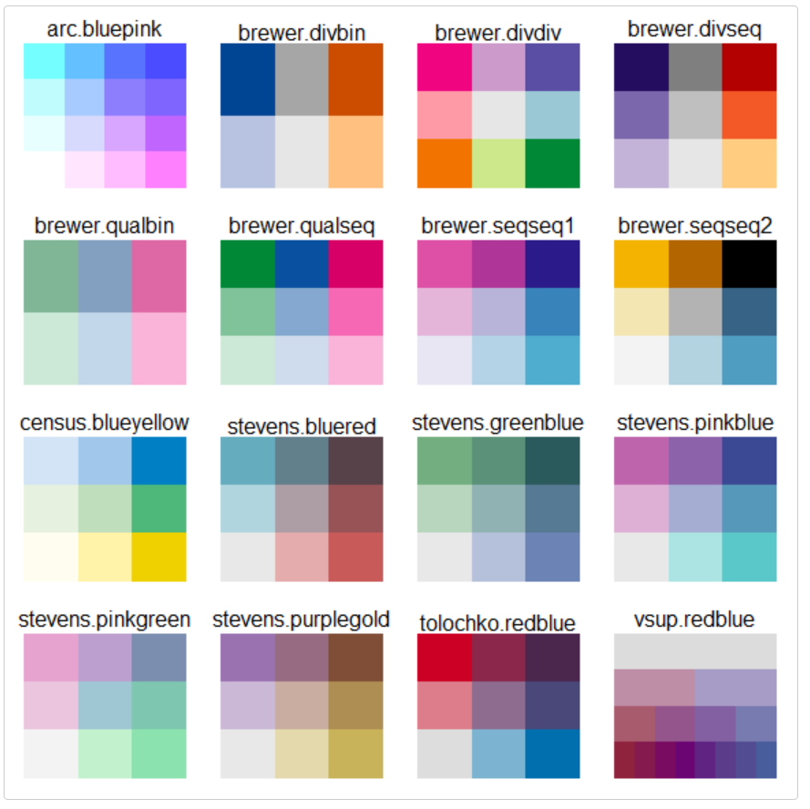

```{r setup, include=FALSE}
knitr::opts_chunk$set(echo = TRUE)
```

### 6.1 Lab Goals

[Chapter 4](https://fuzhen-yin.github.io/uccs_geoviz/lab4.html) and [Chapter 5](https://fuzhen-yin.github.io/uccs_geoviz/lab5.html) have introduced the fundamentals of spatial data manipulation and map-making, particularly, producing single-variable thematic maps. In this chapter, we will learn to: 

* visualize **time series** data
* create **cartograms**
* make **bivariate** choropleth map


### 6.2 Good Practice

#### 6.2.1 Organizing Folders & Sub-folders
Under the course folder, please create a folder called "**lab6**". Next, in the **lab6** folder, please create two [sub-folders]{.ul} that one is called "**data**" and another one is "**plot**". 

#### 6.2.2 Data
This chapter continues to explore spatial data sources other than [US Census Bureau](https://data.census.gov/). We will use the [311 Service Requests in 2023](https://opendata-geospatialdenver.hub.arcgis.com/search?q=311) and [Parks, Medians, and Parkway Trees](https://opendata-geospatialdenver.hub.arcgis.com/datasets/geospatialDenver::parks-medians-and-parkway-trees/about). 


> 311 data contains pertinent information related to inquiries and service requests for the City and County of Denver.


Please follow the steps below to [download]{.ul} data, [unzip]{.ul} it and [move]{.ul} the data to the required folder. 

* **Go** to https://github.com/fuzhen-yin/uccs_geoviz/blob/main/data/lab6_data.zip
* **Download** the file _"lab6_data.zip"_
* **Unzip** folder _"lab6_data.zip"_
* **Move** all files from the "_lab6_data_" folder to the _"data"_ folder under "_lab6_" see [Step 6.2.1](https://fuzhen-yin.github.io/uccs_geoviz/lab6.html#621_Organizing_Folders__Sub-folders) 


If there you have any questions about the above-mentioned steps, please refer to [Chapter 3.2.3](https://fuzhen-yin.github.io/uccs_geoviz/lab3.html#322_Data) for detailed instructions. 


#### 6.2.3 Launching R Studio

Again, we would like to start a **new project** from scratch with a **clean R Script**. Please do the following steps. If you have any questions about these steps, please refer to the relevant chapters for help. 

* Step 1: Make sure all existing R projects are **properly closed**. 
    + If *not*, please close it by going to *File* --> *Close Project* --> *Save* changes (see [Chapter 2.5](https://fuzhen-yin.github.io/uccs_geoviz/lab2.html#25_Close__Exit)). 
* Step 2: Create a **New Project** using **Existing Directory**, navigate to **lab6**, click **open**, then **Create Project**. (see [Chapter 1.3](https://fuzhen-yin.github.io/uccs_geoviz/lab1.html#13_Launching_RStudio)). 
* Step 3: Create a **New Script** by go to **File** --> **New File** --> **R Script**. **Save** the script by giving it a proper name.


#### 6.2.4 Before Start 

:::: {.bluebox data-latex=""}
::: {.left data-latex=""}
[**Heads-Up! **]{.ul}
:::

All scripts is **non-copyable**. 

::::

<br>

### 6.3 Libraries & Input Data 

Load libraries. 
```{r, eval=FALSE, class.source = "nocopy"}
### Library
library(dplyr)        # data manipulation
library(tidyverse)    # tidy data 
library(reshape2)     # one-hot encoding 

library(sf)           # simple features     
library(geojsonsf)    # read geojson

library(tmap)         # mapping 
library(ggplot2)      # plot 

library(viridis)      # viz - color

library(cartogram)    # map - cartogram
library(pals)         # bivariate color palette
require(classInt)     # classIntervals, findCols
require(lattice)      # levelplot
require(grid)         # viewport
```

Input data 
```{r, eval=FALSE, class.source = "nocopy"}
# Denver neighborhood (geojson --> simple features)
sf_den_ngbr <- geojson_sf("data/Denver_neighborhood.geojson")

# Denver 311 service requests (csv -- > data frame)
df_den_311 <- read.csv("data/2023_denver_311_service_request_cleaned.csv")

# Denver Trees (around 1 minute to read the data)
sf_den_tree <- geojson_sf("data/denver_trees.geojson")
```


### 6.4 Viz: 311 Service Requests by Week

In the [previous chapter](https://fuzhen-yin.github.io/uccs_geoviz/lab5.html), we have played with [AirBnb data](https://insideairbnb.com/get-the-data/). 

This week, we will play with [311 Service Requests in Denver](https://opendata-geospatialdenver.hub.arcgis.com/search?q=311). [311](https://denvergov.org/Government/Agencies-Departments-Offices/Agencies-Departments-Offices-Directory/311-City-Services) is a special telephone number supported in many communities in the United States that provides access to non-emergency municipal services like [reporting abandoned vehicles, noise complaints, and graffiti]{.ul}. 


#### 6.4.1: Exploring 311 data 

Before any analysis and visualization tasks, the first step is to learn about the data and check what are the attributes (or columns) in the data. 

**[Q]** In your opinion, which column is most interesting and briefly explain why.

```{r, eval=FALSE, class.source = "nocopy"}
# open data
View(df_den_311)
```

And the distributions of the variables in, e.g., the ``` Agency ``` column. 
```{r, eval=FALSE, class.source = "nocopy"}
# contingency table of the attribute 'Agency'
tb_311_agency_freq <- table(df_den_311$Agency)
View(tb_311_agency_freq)

# plot: contingency table
barplot(tb_311_agency_freq, main="311 Requests - Agency", las=2, cex.names = 0.5)
```

#### 6.4.2: Data Type 

Check data type of each column. **[Q]** What is the data type of the column ``` Case_Created_dttm ```. 
```{r, eval=FALSE, class.source = "nocopy"}
# data type
str(df_den_311)
```

The column ``` Case_Created_dttm ``` records at what date and time the "311 request" was received. Let's convert this column to a particular data type as ** date **. [Read more](https://www.stat.berkeley.edu/~s133/dates.html) about the datetime format in R.  

```{r, eval=FALSE, class.source = "nocopy"}
# convert to date 
df_den_311$Case_Created_dttm   # Fri, 29 Dec 2023 19:20:08 GMT
df_den_311$case_create_date <- as.Date(df_den_311$Case_Created_dttm, 
                                       format = "%a, %d %b %Y %H:%M:%S")

# extract week numbers 
df_den_311$case_create_wk <- strftime(df_den_311$case_create_date, 
                                      format = "%V") %>% as.numeric()
```

**[Q]** What is the data type of the column ``` Case_Created_dttm ```?

```{r, eval=FALSE, class.source = "nocopy"}
# Check data type again. 
str(df_den_311)
```


#### 6.4.3: Top 5 Service Reuqests Categories  

The column ``` Case_Summary ``` categorizes people's 311 requests into different types. Let's check what issues that people have reported in 2023 and their frequency.  

**[Q]** What are the top 5 categories of  311 service requests?

```{r, eval=FALSE, class.source = "nocopy"}
# Case summary - contingency table - ordered by frequency 
df_311_summary <- table(df_den_311$Case_Summary) %>% 
  as.data.frame() %>% arrange(-Freq)

# check
View(df_311_summary)
```

OK, there are over 1000 categories of service requests. Let's only focus on the top 5 frequently mentioned category and save it as a new data ``` df_den_311_top ```. 

```{r, eval=FALSE, class.source = "nocopy"}
# extract 311 requests in the most mentioned categories 
df_den_311_top <- df_den_311 %>% 
  filter(Case_Summary %in% df_311_summary$Var1[1:5]) %>% 
  select(case_create_wk, Case_Summary) %>% 
  mutate(n=1)
```

Count the number of 311 service requests in the top 5 categories by week. 
```{r, eval=FALSE, class.source = "nocopy"}
#  (one-hot encoding)
df_den_311_top <- dcast(df_den_311_top, 
                        case_create_wk ~ Case_Summary, 
                        fill = 0, value.var = "n",
                        fun.aggregate = length)

View(df_den_311_top)
```


From here, we are going to change the structure of the data ``` df_den_311_top ``` and reshape (or [tidy](https://r4ds.had.co.nz/tidy-data.html)) it in a specific way so that: 

* Each variable must have its own column.
* Each observation must have its own row.
* Each value must have its own cell.

The process if tidying is illustrated in Figure 6.1. 

**[Q]** Please compare the ``` df_den_311_top ``` before and after, and try to explain how the "tidy" process changes the data structure. If you need to look at the previous data, please go back to [Step 6.4.3](https://fuzhen-yin.github.io/uccs_geoviz/lab6.html#643:_Top_5_Service_Reuqests_Categories) and rerun the script from there. 

{width=80%}
<br>

```{r, eval=FALSE, class.source = "nocopy"}
# Tidy data using the function pivot_longer()
df_den_311_top <- df_den_311_top %>% 
  pivot_longer(cols = 2:ncol(.), names_to = "category", values_to ="count")

```

#### 6.4.4: Time Series Plot

Let's make a basic plot exploring how the top 5 categories of 311 requests change over times (by week). 
```{r, eval=FALSE, class.source = "nocopy"}
# viz: time series 
p1_311 <- ggplot(df_den_311_top, aes(x=case_create_wk, y=count, fill=category)) +
  geom_area(alpha=0.6 , linewidth=.5, colour="white")

# have a look
p1_311
```

Improve the plot by using the **viridis** color palette from the ``` viridis ``` library. 
```{r, eval=FALSE, class.source = "nocopy"}
# viz: improve 
p2_311 <- ggplot(df_den_311_top, aes(x=case_create_wk, y=count, fill=category)) +
  geom_area(alpha=0.6 , linewidth=.5, colour="white") + 
  scale_fill_viridis(discrete = T) + 
  theme_bw() +
  xlab("Weeks in 2023") + 
  ylab(" Count of 311 Service Requests")
  
  
# export 
pdf("plot/plot2_311_service_cat_week.pdf", width = 10, height = 6)
print(p2_311)
dev.off()

```

Okay, while the plot looks better now, the week number is very confusing. Let's add some labels by connecting week numbers to seasons as suggested by Figure 6.2. 

**[Q]** Paste the screenshot of "plot3_311_service_cat_week_reference.pdf" to your report. Please **briefly discuss** your findings from this analysis (failed to do this will result in _2 points deduction_). 

{width=80%}

<br>

```{r, eval=FALSE, class.source = "nocopy"}
# create a df showing when the four seasons start 
df_311_season_label <- data.frame(
  x_season = c(5,18,31,44),
  y_season = 2000, 
  label = c("Winter","Spring", "Summer", "Fall")
)

# viz: improve by adding annotation & reference lines  
p3_311 <- ggplot(df_den_311_top, aes(x=case_create_wk, y=count, fill=category)) +
  geom_area(alpha=0.6 , size=.5, colour="white") + 
  scale_fill_viridis(discrete = T) + 
  theme_bw() +
  geom_vline(xintercept = c(10,23,36,49),colour="black", linetype = "dotted") + 
  geom_label(data=df_311_season_label, aes(x = x_season, y = y_season, label = label), fill = "white", size=4)  + 
  xlab("Weeks in 2023") + 
  ylab(" Count of 311 Service Requests") 


# export 
pdf("plot/plot3_311_service_cat_week_reference.pdf", width = 10, height = 6)
print(p3_311)
dev.off()

```

### 6.5: Viz: Mapping 311 Requests


This section moves from time-series to spatial visualization of the 311 data. 

**[Q]** Please open the data frame ``` df_den_311 ``` and report which columns contain spatial information of 311 requests and could be used to convert "df_den_311" to spatial data?  

```{r, eval=FALSE, class.source = "nocopy"}
# open
View(df_den_311)

# list all column names 
names(df_den_311)
```

#### 6.5.1: From Dataframe to Simple Features

Create simple features of 311 service requests and save the data as ``` sf_den_311 ```. 
```{r, eval=FALSE, class.source = "nocopy"}
# Convert to spatial points 
sf_den_311 <- st_as_sf(df_den_311, coords = c("Longitude", "Latitude"), crs = 4326)
```


Let's check the CRS (coordinate reference system) of all simple features we have and project them to the 2D CRS, [NAD83 / Colorado North (ftUS)](https://epsg.io/2231), which has its centroid in Colorado.  

> The value **2231** is the unique index for the CRS [NAD83 / Colorado North (ftUS)](https://epsg.io/2231). More CRS could be found here [https://epsg.io/](https://epsg.io/). 


```{r, eval=FALSE, class.source = "nocopy"}
# four spatial data (simple features). Let's check their coordination systems 
sf_den_311$geometry
sf_den_tree$geometry
sf_den_ngbr$geometry

# project the data to NAD83 / Colorado North (ftUS)
# https://epsg.io/2231 - NAD83 / Colorado North (ftUS)
sf_den_311 <- st_transform(sf_den_311, 2231)
sf_den_tree <- st_transform(sf_den_tree, 2231)
sf_den_ngbr <- st_transform(sf_den_ngbr, 2231)
```


```{r, eval=FALSE, class.source = "nocopy"}
## create a column "label" for mapping 
sf_den_ngbr$label <- sf_den_ngbr$neighbourhood
sf_den_ngbr$label <- gsub(" ", "\n", sf_den_ngbr$label)


```


```{r, eval=FALSE, class.source = "nocopy"}
# Count 311 (2023) in each neighborhood  
sf_den_ngbr_311 <- sf_den_ngbr
sf_den_ngbr_311["n_311"] <- lengths(st_intersects(sf_den_ngbr_311, sf_den_311))

```


```{r, eval=FALSE, class.source = "nocopy"}
# quick plot of count of 311 in neighborhood 
tmap_mode("plot")

map1_ngbr_311 <- tm_shape(sf_den_ngbr_311) + 
  tm_polygons(col = "n_311", title = "311 Calls in 2023", palette = "Blues") + 
  tm_text(text = "label", size=0.4) +
  tm_compass(position = c("left", "top")) +
  tm_scale_bar(width = 0.1, position = c("left", "top"))

pdf("plot/map1_ngbr_311_requests_in_2023.pdf", width = 10, height = 8)
print(map1_ngbr_311)
dev.off()
# **[Q]** Which neighborhood that most 311 calls complain about? 

```


#### Cartogram 1 
```{r, eval=FALSE, class.source = "nocopy"}
# cartogram 1
# Construct a continuous area cartogram by a rubber sheet distortion algorithm
sf_den_ngbr_311_carto <- cartogram_cont(sf_den_ngbr_311, "n_311", itermax = 10)

map2_ngbr_311_c1 <- tm_shape(sf_den_ngbr_311_carto) + 
  tm_polygons(col = "n_311", title = "311 Calls in 2023", palette = "Blues") + 
  tm_text(text = "label", size=0.4) +
  tm_compass(position = c("left", "top")) +
  tm_scale_bar(width = 0.1, position = c("left", "top"))


pdf("plot/map2_ngbr_311_requests_in_2023_carto1.pdf", width = 10, height = 8)
print(map2_ngbr_311_c1)
dev.off()

```

#### Cartogram 2
```{r, eval=FALSE, class.source = "nocopy"}
# cartogram 2
# Construct a cartogram which represents each geographic region as non-overlapping circles (Dorling 1996).
sf_den_ngbr_311_carto_dorling <- cartogram_dorling(sf_den_ngbr_311, weight = "n_311", itermax = 10)

map3_ngbr_311_c2 <- tm_shape(sf_den_ngbr_311_carto_dorling) + 
  tm_polygons(col = "n_311",  title = "311 Calls in 2023", palette = "Blues") + 
  tm_text(text = "label", size="n_311") +
  tm_compass(position = c("left", "top")) +
  tm_scale_bar(width = 0.1, position = c("left", "top"))

pdf("plot/map3_ngbr_311_requests_in_2023_carto2_dorling.pdf", width = 10, height = 8)
print(map3_ngbr_311_c2)
dev.off()

```


### 6.6 Tree Maps 
```{r, eval=FALSE, class.source = "nocopy"}
## spatial join to get neighobrhood information 
sf_den_tree_ngbr <- st_join(sf_den_tree, sf_den_ngbr["neighbourhood"], left = T, join = st_intersects)

#  **[Q]** Which two column tell about the species of trees? 
View(sf_den_tree_ngbr)
# tree species 
df_tree_spec <- table(sf_den_tree_ngbr$SPECIES_COMMON) %>% as.data.frame() %>% arrange(-Freq)
View(df_tree_spec)

```


```{r, eval=FALSE, class.source = "nocopy"}
# neighborhood tree species count 
df_ngbr_tree <- sf_den_tree_ngbr %>% 
  select(neighbourhood, SPECIES_COMMON) %>% 
  mutate(n=1)
st_geometry(df_ngbr_tree) <- NULL
df_ngbr_tree <- dcast(df_ngbr_tree, neighbourhood ~ SPECIES_COMMON, 
                      fill = 0, value.var = "n", fun.aggregate = length)
View(df_ngbr_tree)

```


```{r, eval=FALSE, class.source = "nocopy"}
# left join to simple features 
sf_den_ngbr_tree <- left_join(sf_den_ngbr, df_ngbr_tree, by = "neighbourhood")

```


#### Bivariate Mapping
```{r, eval=FALSE, class.source = "nocopy"}
## bivariate map 
# two tree species 
lt_tree_specs_lbl <- c("Honey Locust", "Maple, Silver")

```


```{r, eval=FALSE, class.source = "nocopy"}
# number of bins 
nbins <- 3

# categorize count of a particular tree species into 3 bins using "quantile
brkhl <- classIntervals(sf_den_ngbr_tree$`Honey Locust`, n=nbins, style='quantile')
brkms <- classIntervals(sf_den_ngbr_tree$`Maple, Silver`, n=nbins, style='quantile')

class_hl <- findCols(brkhl)
class_ms <- findCols(brkms)

# convert x,y classes into a joint class x+3(y-1)
sf_den_ngbr_tree$class_hl_ms <- class_hl + nbins*(class_ms-1)

# bivariate color palette 
col_biv <- stevens.bluered()

```


```{r, eval=FALSE, class.source = "nocopy"}
map4_ngbr_trees_biv <- tm_shape(sf_den_ngbr_tree) + tm_polygons("class_hl_ms", palette =col_biv, n =9 ) +
  tm_text(text = "label", size=0.5) +
  tm_compass(position = c("left", "top")) +
  tm_scale_bar(width = 0.1, position = c("left", "top")) +
  tm_layout(legend.show = F)

# add the color legend
map_legend <- levelplot(matrix(1:(nbins*nbins), nrow=nbins), axes=FALSE, col.regions=col_biv,
          xlab=list("Honey Locust -->", cex= 0.7), ylab=list("Maple, Silver -->", cex=0.7), cuts=8, colorkey=FALSE,
          scales=list(draw=0))

vp <- viewport(x=.75, y=.25, width=.15, height=.15)

```


```{r, eval=FALSE, class.source = "nocopy"}
# export 
pdf("plot/map4_neighborhood_bivariate_trees.pdf", width = 12, height = 12)

print(map4_ngbr_trees_biv)
pushViewport(vp)
print(map_legend, newpage=FALSE)
popViewport()

dev.off()

```


```{r, eval=FALSE, class.source = "nocopy"}
#

```


```{r, eval=FALSE, class.source = "nocopy"}
#

```


```{r, eval=FALSE, class.source = "nocopy"}
#

```


```{r, eval=FALSE, class.source = "nocopy"}
#

```


```{r, eval=FALSE, class.source = "nocopy"}
#

```


```{r, eval=FALSE, class.source = "nocopy"}
#

```


```{r, eval=FALSE, class.source = "nocopy"}
#

```


```{r, eval=FALSE, class.source = "nocopy"}
#

```


```{r, eval=FALSE, class.source = "nocopy"}
#

```


```{r, eval=FALSE, class.source = "nocopy"}
#

```


```{r, eval=FALSE, class.source = "nocopy"}
#

```


```{r, eval=FALSE, class.source = "nocopy"}
#

```


```{r, eval=FALSE, class.source = "nocopy"}
#

```


```{r, eval=FALSE, class.source = "nocopy"}
#

```


```{r, eval=FALSE, class.source = "nocopy"}
#

```


{width=50%}


{width=70%}


```{r, eval=FALSE, class.source = "nocopy"}
#

```


```{r, eval=FALSE, class.source = "nocopy"}
#

```


```{r, eval=FALSE, class.source = "nocopy"}
#

```


```{r, eval=FALSE, class.source = "nocopy"}
#

```


```{r, eval=FALSE, class.source = "nocopy"}
#

```


```{r, eval=FALSE, class.source = "nocopy"}
#

```


```{r, eval=FALSE, class.source = "nocopy"}
#

```


```{r, eval=FALSE, class.source = "nocopy"}
#

```


```{r, eval=FALSE, class.source = "nocopy"}
#

```


```{r, eval=FALSE, class.source = "nocopy"}
#

```


```{r, eval=FALSE, class.source = "nocopy"}
#

```


```{r, eval=FALSE, class.source = "nocopy"}
#

```


```{r, eval=FALSE, class.source = "nocopy"}
#

```


```{r, eval=FALSE, class.source = "nocopy"}
#

```


```{r, eval=FALSE, class.source = "nocopy"}
#

```


```{r, eval=FALSE, class.source = "nocopy"}
#

```


```{r, eval=FALSE, class.source = "nocopy"}
#

```


```{r, eval=FALSE, class.source = "nocopy"}
#

```


```{r, eval=FALSE, class.source = "nocopy"}
#

```


```{r, eval=FALSE, class.source = "nocopy"}
#

```


```{r, eval=FALSE, class.source = "nocopy"}
#

```


```{r, eval=FALSE, class.source = "nocopy"}
#

```


```{r, eval=FALSE, class.source = "nocopy"}
#

```


```{r, eval=FALSE, class.source = "nocopy"}
#

```


```{r, eval=FALSE, class.source = "nocopy"}
#

```


```{r, eval=FALSE, class.source = "nocopy"}
#

```


```{r, eval=FALSE, class.source = "nocopy"}
#

```


```{r, eval=FALSE, class.source = "nocopy"}
#

```


```{r, eval=FALSE, class.source = "nocopy"}
#

```


```{r, eval=FALSE, class.source = "nocopy"}
#

```


```{r, eval=FALSE, class.source = "nocopy"}
#

```


```{r, eval=FALSE, class.source = "nocopy"}
#

```


```{r, eval=FALSE, class.source = "nocopy"}
#

```


```{r, eval=FALSE, class.source = "nocopy"}
#

```


```{r, eval=FALSE, class.source = "nocopy"}
#

```


```{r, eval=FALSE, class.source = "nocopy"}
#

```


```{r, eval=FALSE, class.source = "nocopy"}
#

```


```{r, eval=FALSE, class.source = "nocopy"}
#

```
