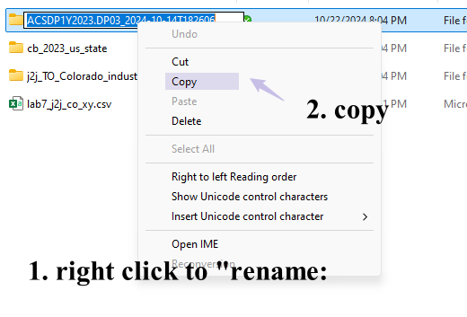

```{r setup, include=FALSE}
knitr::opts_chunk$set(echo = TRUE)
```


### 8.1 Lab Goals

This chapter continues our conversation about [Network Visualization](https://fuzhen-yin.github.io/uccs_geoviz/lab7.html) by exploring:

* How to **improve** network maps 
* Combine spatial networks with **thematic maps** 
* Build **interactive sankey chart** to visualize non-spatial networks
* Produce **correlation** matrix

### 8.2 Good Practice

#### 8.2.1 Organizing Folders & Sub-folders
Under the course folder, please create a folder called "**lab8**". Next, in the **lab8** folder, please create two [sub-folders]{.ul} that one is called "**data**" and another one is "**plot**". 

#### 8.2.2 Data
This chapter continues to explore [Job-to-Job Flows Explorer (J2J)](https://j2jexplorer.ces.census.gov/) by using Colorado as a case study. In addition to the job-to-job (j2j) flows between states, we also explore the j2j flows to 20 industries to 20 industries in Colorado. The filters used to download such data is shown in Figure 8.1. 

{width=100%}

<br>

Furthermore, this lab also collects the [DP03 Economic Characteristics](https://data.census.gov/table/ACSDP1Y2023.DP03?t=Employment&g=010XX00US$0400000) within all US States using the American Community Survey (ACS) 1-year estimate from US Census. 


Please follow the steps below to [download]{.ul} data, [unzip]{.ul} it and [move]{.ul} the data to the required folder. 

* **Go** to https://github.com/fuzhen-yin/uccs_geoviz/blob/main/data/lab8_data.zip
* **Download** the file _"lab8_data.zip"_
* **Unzip** folder _"lab8_data.zip"_
* **Move** all files from the "_lab8_data_" folder to the _"data"_ folder under "_lab8_" see [Step 8.2.1](https://fuzhen-yin.github.io/uccs_geoviz/lab8.html#821_Organizing_Folders__Sub-folders) 


If there you have any questions about the above-mentioned steps, please refer to [Chapter 3.2.3](https://fuzhen-yin.github.io/uccs_geoviz/lab3.html#322_Data) for detailed instructions. 


#### 8.2.3 Launching R Studio

Again, we would like to start a **new project** from scratch with a **clean R Script**. Please do the following steps. If you have any questions about these steps, please refer to the relevant chapters for help. 

* Step 1: Make sure all existing R projects are **properly closed**. 
    + If *not*, please close it by going to *File* --> *Close Project* --> *Save* changes (see [Chapter 2.5](https://fuzhen-yin.github.io/uccs_geoviz/lab2.html#25_Close__Exit)). 
* Step 2: Create a **New Project** using **Existing Directory**, navigate to **lab8**, click **open**, then **Create Project**. (see [Chapter 1.3](https://fuzhen-yin.github.io/uccs_geoviz/lab1.html#13_Launching_RStudio)). 
* Step 3: Create a **New Script** by go to **File** --> **New File** --> **R Script**. **Save** the script by giving it a proper name.


#### 8.2.4 Before Start 

:::: {.bluebox data-latex=""}
::: {.left data-latex=""}
[**Heads-Up! **]{.ul}
:::

All scripts are **non-copyable**. 
Please **read** the tutorial **carefully** and try to **understand** the script as you would need to **re-write** some part of the script to complete the report.  

::::

<br>


### 8.3 Libraries & Data 

#### 8.3.1 Load Libraries

Please install necessary packages by yourself. 
```{r, class.source = "nocopy",  message=FALSE, warning=FALSE, cache=FALSE}
# Library ----
library(dplyr)
library(data.table)
library(sf)
library(tidyverse)
library(igraph)

library(GGally)       # correlation diagram
library(ggplot2)
library(ggspatial)

library(networkD3)  # sankey network 
```

#### 8.3.2 Data

**Work smarter, not harder**. 

Instead of writing the path by yourself, please copy file name from file directories as shown in Figure 8.2. 

{width=60%}
<br>

```{r, class.source = "nocopy",  message=FALSE, warning=FALSE, cache=FALSE}
# US Census CB (cartographic boundaries) by states (simple features) 
# project it to "CRS NAD83 / Colorado North (ftUS)"
sf_us_state <- st_read("data/cb_2023_us_state/cb_2023_us_state_5m.shp") %>% st_transform(., 2231)

# lab7 (Section 7.6) - j2j outflow and inflow for all NAICS sections 
j2j_co_xy <- read.csv("data/lab7_j2j_co_xy.csv")

# j2j inflow to CO by industry 
j2j_inflow_industry <- read.csv("data/j2j_TO_Colorado_industries_2023Q1_Q2_Q3/table.csv")

# ACS 2023 - all states within US - 1yr estimate 
# Data (Table TP03): Selected Economic Characteristics
df_economic <- read.csv("data/ACSDP1Y2023.DP03_2024-10-14T182606/ACSDP1Y2023.DP03-Data.csv")
# Metadata (Table TP03)
df_economic_meta <- read.csv("data/ACSDP1Y2023.DP03_2024-10-14T182606/ACSDP1Y2023.DP03-Column-Metadata.csv")

# lists extracted from j2j data 
# list of states in "j2j_co_xy" networks 
lt_state <- unique(c(j2j_co_xy$from_state, j2j_co_xy$to_state))
# list of naics sectors in "j2j_co_xy" data 
lt_sector <- unique(c(j2j_co_xy$naics_sector))
```


### 8.4 Viz: Improve J2J Flows Network from Lab 7
#### 8.4.1 Data Preparation 

```{r, class.source = "nocopy",  message=FALSE, warning=FALSE, cache=FALSE}
## extract JOB OUTFLOW network
# edges
dt_edge <- j2j_co_xy %>% filter(direction == "outflow_from_co",
                             naics_sector == "all_sectors")

# node - states polygons
dt_node <- sf_us_state %>% filter(NAME %in% unique(c(dt_edge$from_state, dt_edge$to_state)))
# node - convert to centroid
dt_node <- st_centroid(dt_node)

# spatial data: state boundaries
# only states that is located in the continuous continental United States 
sf_j2j_state <- sf_us_state %>% 
  filter(GEOID < "60") %>% 
  filter(! NAME %in% c("Hawaii", "Alaska"))
```


#### 8.4.2 Improve the Map of j2j Netowkrs   
At the end of previous lab [Section 7.6.2](https://fuzhen-yin.github.io/uccs_geoviz/lab7.html#762_Function:_Job_Outflow_Network), we have produced a map of job outflow network from Colorado to other states that is similar to the map below. 

```{r, class.source = "nocopy",  message=FALSE, warning=FALSE, cache=FALSE, fig.width = 10, fig.height = 6}
## Mapping network - from Lab 7
c_edge <- "blue"
lbl_title <- "Job Outflow from Colorado, 2023 Q1-Q3"

ggplot(sf_j2j_state) + 
  geom_sf() + 
  geom_sf(data = dt_node) + 
  geom_segment(data = dt_edge,
               aes(x = long_start, y = lat_start, 
                   xend = long_end, yend = lat_end, size = avg_n_job, alpha = 0.5), 
               colour = c_edge) + 
  scale_size_continuous(range = c(0.01, 4)) + 
  ggtitle(lbl_title) + 
  theme_bw() + 
  ylab("Latitude") + 
  xlab("Longitude")
```

Here are some frequently mentioned comments from lab7 report about how to improve the maps: 

* Make edge color scale to the strength of job flow; 
* Use state abbreviation;
* Improve legend;
* Add North Arrow and Scale Bars 

Let's do that! 

```{r, class.source = "nocopy",  message=FALSE, warning=FALSE, cache=FALSE, fig.width = 10, fig.height = 6}
# Make edge color scale to the strength of job flow; use abbreviation
p1 <- ggplot(sf_j2j_state) + 
  geom_sf(fill = "white") + 
  geom_segment(data = dt_edge,
               aes(x = long_start, y = lat_start, 
                   xend = long_end, yend = lat_end, size = avg_n_job, colour = avg_n_job),
               alpha = 0.9) + 
  scale_color_distiller(palette = "Reds", trans = "reverse") +
  scale_size_continuous(range = c(0.001, 5)) +
  geom_sf_text(data = dt_node, aes(label = STUSPS), size = 2) + 
  ggtitle(lbl_title) + 
  theme_bw() + 
  ylab("Latitude") + 
  xlab("Longitude")

print(p1)
```

```{r, class.source = "nocopy",  message=FALSE, warning=FALSE, cache=FALSE, fig.width = 10, fig.height = 6}
# improve legend 
p2 <- ggplot(sf_j2j_state) + 
  geom_sf(fill = "white") + 
  geom_segment(data = dt_edge,
               aes(x = long_start, y = lat_start, 
                   xend = long_end, yend = lat_end, size = avg_n_job, colour = avg_n_job),
               alpha = 0.9) + 
  scale_color_distiller(palette = "Reds", trans = "reverse", name = "Job flow strength") +
  scale_size_continuous(range = c(0.001, 5), name = "Job flow strength") +
  geom_sf_text(data = dt_node, aes(label = STUSPS), size = 2) + 
  ggtitle(lbl_title) + 
  theme_bw() + 
  ylab("Latitude") + 
  xlab("Longitude")

print(p2)
```


```{r, class.source = "nocopy",  message=FALSE, warning=FALSE, cache=FALSE, fig.width = 10, fig.height = 6}
# by adding North Arrow and Scale Bars 
p3 <- p2 + 
  annotation_scale(location = "bl", width_hint = 0.1) + 
  annotation_north_arrow(location = "bl", 
                         pad_x = unit(0.1, "in"), 
                         pad_y = unit(0.3, "in"),
                         height = unit(0.3, "in"),
                         width = unit(0.3, "in")) 

print(p3)
```


### 8.5 Viz: J2J Network VS Economic Characteristics 
After mapping the j2j network, an intuitive question is **what are the potential reasons behind job inflow/outflow**. This section aims to explain the j2j patterns by linking them to states' economic characteristics. 

Check the [DP03 Economic Characteristics](https://data.census.gov/table/ACSDP1Y2023.DP03?t=Employment&g=010XX00US$0400000) data. 
```{r, eval=FALSE, class.source = "nocopy"}
#### Economic Characteristic by State 
View(df_economic)
View(df_economic_meta)
```


#### 8.5.1 Data Cleaning & Processing 
Identify the variables to extract from the "df_economic" data table. 
```{r, class.source = "nocopy",  message=FALSE, warning=FALSE, cache=FALSE}
lt_ecnomic_index <- c("DP03_0119PE", "DP03_0047PE", "DP03_0048PE", 
                      "DP03_0049PE", "DP03_0050PE", "DP03_0062E",
                      "DP03_0009PE")
lt_economic_var_name <- c("pct_fam_below_poverty", "pct_cvl_16plus_emp_priv", "pct_cvl_16plus_emp_govr", 
                          "pct_cvl_16plus_emp_self", "pct_cvl_16plus_emp_unpaid", "median_hh_income",
                          "unemply_rate")
```

Data cleaning
```{r, class.source = "nocopy",  message=FALSE, warning=FALSE, cache=FALSE}
# clean the economic data table "df_economic" 
df_economic_cln <- df_economic %>% select(GEO_ID, NAME, all_of(lt_ecnomic_index))

# delete first row 
df_economic_cln <- df_economic_cln[-1, ]

# update column names to meaningful names
df_economic_cln <- setnames(df_economic_cln, old = lt_ecnomic_index, new=lt_economic_var_name)
```


Data processing by converting them to numeric. 
```{r, class.source = "nocopy",  message=FALSE, warning=FALSE, cache=FALSE}
# check column data type 
str(df_economic_cln)

# convert columns to numeric 
df_economic_cln[, 3:ncol(df_economic_cln)] <- sapply(df_economic_cln[, 3:ncol(df_economic_cln)], 
                                                     as.numeric) %>% as.data.frame()
```

#### 8.5.2 Pearson Correlation Matrix
Let's use job flow from other states to Colorado as an example to examine how the strength of job flow is correlated to a state's economic characteristics.


Preparing job inflow data. 
```{r, class.source = "nocopy",  message=FALSE, warning=FALSE, cache=FALSE}
# filter inflow to Colorado 
data <- j2j_co_xy %>% filter(direction == "inflow_to_co", 
                             naics_sector=="all_sectors") %>% 
  select(from_state, naics_sector, avg_n_job)

# untidy the data by using "pivot_wider" 
data <- pivot_wider(data, names_from = "naics_sector", values_from = "avg_n_job")
```

Join the inflow data with states' economic status. 
```{r, class.source = "nocopy",  message=FALSE, warning=FALSE, cache=FALSE}
# left join economic data with the inflow data 
data <- left_join(df_economic_cln, data, by=c("NAME" = "from_state"))
# remove na 
data <- na.omit(data)
```

**[Q1]** Please interpret the results from the correlation matrix. 

```{r, class.source = "nocopy",  message=FALSE, warning=FALSE, cache=FALSE}
# Pearson correlation matrix 
ggcorr(data, label = TRUE, hjust = 0.75)
```


#### 8.5.3 Mapping J2J Flow Network with Economic Status
```{r, class.source = "nocopy",  message=FALSE, warning=FALSE, cache=FALSE}
# join state boundary with economic data 
sf_j2j_state_econ <- left_join(sf_j2j_state, df_economic_cln, by=c("GEOIDFQ" = "GEO_ID",
                                                                   "NAME"="NAME"))
```


```{r, class.source = "nocopy",  message=FALSE, warning=FALSE, cache=FALSE}
# Inflow network edge & node
dt_edge <- j2j_co_xy %>% filter(direction == "inflow_to_co",
                                naics_sector == "all_sectors")

# node - states polygons
dt_node <- sf_us_state %>% filter(NAME %in% unique(c(dt_edge$from_state, dt_edge$to_state)))
# node - convert to centroid
dt_node <- st_centroid(dt_node)
```


```{r, class.source = "nocopy",  message=FALSE, warning=FALSE, cache=FALSE, fig.width = 10, fig.height = 6}
## mapping 
lbl_title <- "2023 Job Inflow to Colorado (Q1-Q3) VS Unemployment Rate"

ggplot(sf_j2j_state_econ) + 
  geom_sf(aes(fill = unemply_rate), colour = "white", alpha = 0.7) + 
  scale_fill_distiller(palette = "Blues", trans = "reverse", name = "Unemployment Rate") +
  geom_segment(data = dt_edge,
               aes(x = long_start, y = lat_start, 
                   xend = long_end, yend = lat_end, size = avg_n_job, colour = avg_n_job),
               alpha = 0.9) + 
  scale_color_distiller(palette = "YlOrRd", trans = "reverse", name = "Job flow strength") +
  scale_size_continuous(range = c(0.001, 5), name = "Job flow strength") +
  geom_sf_text(data = dt_node, aes(label = STUSPS), size = 2) + 
  ggtitle(lbl_title) + 
  theme_bw() + 
  ylab("Latitude") + 
  xlab("Longitude") + 
  annotation_scale(location = "bl", width_hint = 0.1) + 
  annotation_north_arrow(location = "bl", 
                         pad_x = unit(0.1, "in"), 
                         pad_y = unit(0.3, "in"),
                         height = unit(0.3, "in"),
                         width = unit(0.3, "in")) 
```

**[Q2]** Please revise the code above to produce another j2j-network map that uses a different variable other than "unemployment rate". Please update the map title and legend title accordingly. Figure 8.3 shows the names of R color palettes. Please provide a screenshot of the new map and briefly explain the findings (2-3 sentences). 

{width=30%}

<br>


### 8.6 Viz: Sankey Chart of Flow Between Industries

This section produces an **interactive sankey chart** to visualize j2j flows from top 10 industries to top 10 industries in Colorado. [Section 8.2.2](https://fuzhen-yin.github.io/uccs_geoviz/lab8.html#822_Data) explains the filters used in [Job-to-Job Flows Explorer (J2J)](https://j2jexplorer.ces.census.gov/) to download this data. 

### 8.6.1 Data Cleaning
```{r, class.source = "nocopy",  message=FALSE, warning=FALSE, cache=FALSE}
# tidy and clean the data 
j2j_inflow_ind_cln <- j2j_inflow_industry %>% 
  pivot_longer(cols = 2:ncol(.), names_to = "to_co_sector", values_to = "avg_n_job" ) %>% 
  filter(!to_co_sector %like% ".flag") %>% 
  na.omit() %>% 
  setnames(old="X", new="from_sector") %>% 
  select(from_sector, to_co_sector, avg_n_job)
```

This code below is **copyable.** 
```{r, message=FALSE, warning=FALSE, cache=FALSE}
# clean sector names to make them consistent 
j2j_inflow_ind_cln$to_co_sector <- j2j_inflow_ind_cln$to_co_sector %>% 
  gsub("\\.\\.", ", ", .) %>% 
  gsub("\\.", " ", .) %>% 
  gsub("Other Services, except Public Administration", 
       "Other Services (except Public Administration)", .) %>% 
  gsub("^\\s+|\\s+$", "", .)
```

### 8.6.2 Network Data 
Prepare network data: edge & node. 
**!!!** Please read carefully this section and try to understand scripts line by line. You would need to re-write this section to complete **[Q3]**. 

**Hint** The function ``` slice_min() ``` could be used to subset the smallest values of a variable. 

```{r, class.source = "nocopy",  message=FALSE, warning=FALSE, cache=FALSE}
# edges 
dt_edge <- j2j_inflow_ind_cln

# top 10 industry with highest inflow to colorado
dt_ten_industry <- dt_edge %>% select(to_co_sector, avg_n_job) %>% 
  group_by(to_co_sector) %>% 
  summarise(n_ttl = sum(avg_n_job)) %>% 
  slice_max(n_ttl, n=10)
```


```{r, class.source = "nocopy",  message=FALSE, warning=FALSE, cache=FALSE}
# extract edges from and to the top ten industries 
dt_edge <- dt_edge %>% 
  filter(from_sector %in% dt_ten_industry$to_co_sector) %>% 
  filter(to_co_sector %in% dt_ten_industry$to_co_sector)
# add space to "to_co_sector"
dt_edge$to_co_sector <- paste(dt_edge$to_co_sector, " ", sep="")
```


```{r, class.source = "nocopy",  message=FALSE, warning=FALSE, cache=FALSE}
# nodes
dt_node <- data.frame(name = unique(c(dt_edge$from_sector,
                                      dt_edge$to_co_sector)))
```


```{r, class.source = "nocopy",  message=FALSE, warning=FALSE, cache=FALSE}
# edges add id for nodes 
dt_edge$id_from <- match(dt_edge$from_sector, dt_node$name) - 1
dt_edge$id_to <- match(dt_edge$to_co_sector, dt_node$name) - 1 
```


```{r, class.source = "nocopy",  message=FALSE, warning=FALSE, cache=FALSE, fig.width = 10, fig.height = 8}
# interactive sankey chart - network
sankeyNetwork(Links = dt_edge, Nodes = dt_node,
              Source = "id_from", Target = "id_to",
              Value = "avg_n_job", NodeID = "name",
              sinksRight=FALSE, nodeWidth=15, fontSize=10, nodePadding=10)
```

The sankey chart above shows the number of jobs from the **top 10** largest industries have been moved to the top 10 largest industries in Colorado. 

**[Q3]** Please re-write the script to produce a sankey chart presenting the job flows from the **BOTTOM 10** industries to the bottom 10 industries in Colorado. Paste a screenshot of your sankey chart to the report. 


**[Q4]** Please list **3-5 functions** that you have learnt from this tutorial and explain when and how to use them. 


### 7.7 Close & Exit

Congratulations!! You have completed the entire tutorial and learnt the intro to network visualization!! 
** Please submit your report on time. A late penalty (5 pts / day) will be applied **. 

Please go "File"--> "Close Project" -- a pop window asking "Do you want to save these changes" --> "Yes".

Don't forget to submit the **lab8 report**  and your **script**  to Canvas. 


```{r, class.source = "nocopy",  message=FALSE, warning=FALSE, cache=FALSE}

```


```{r, class.source = "nocopy",  message=FALSE, warning=FALSE, cache=FALSE}

```


```{r, class.source = "nocopy",  message=FALSE, warning=FALSE, cache=FALSE}

```


